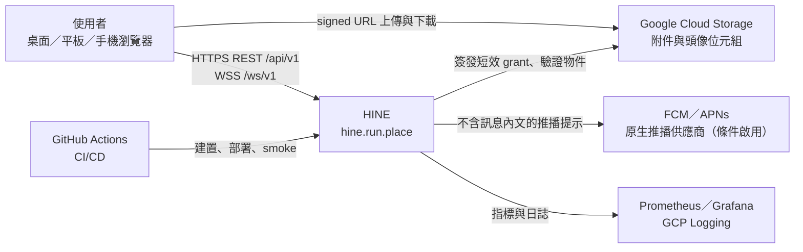
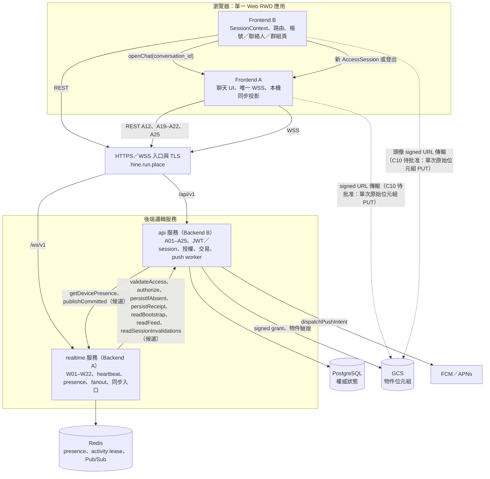
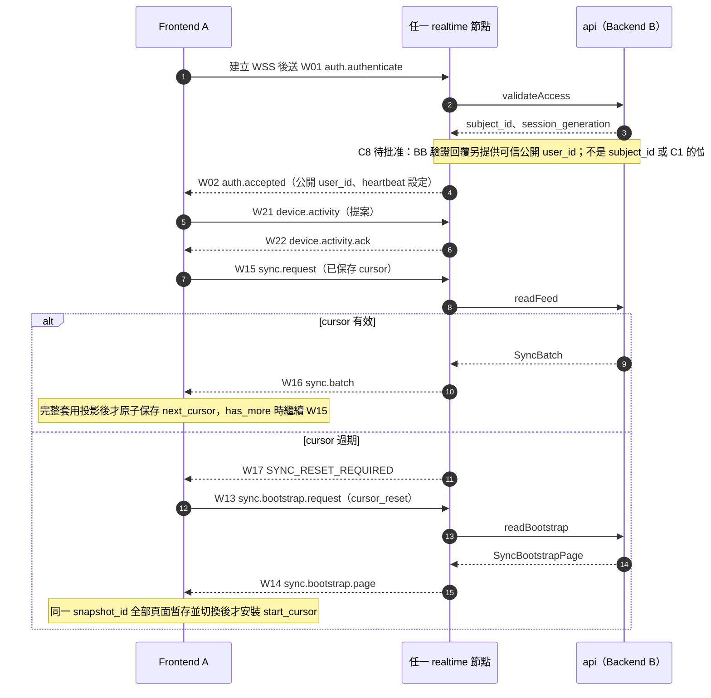
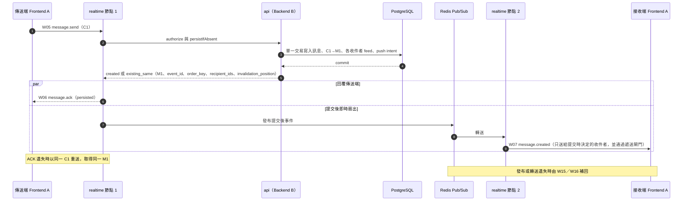
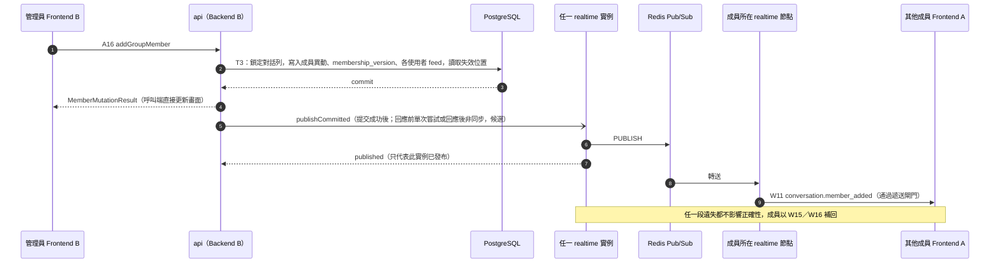
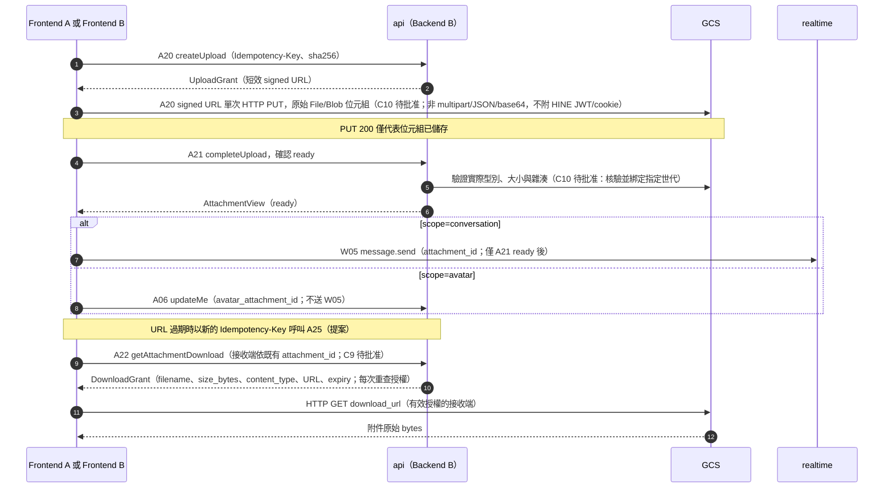
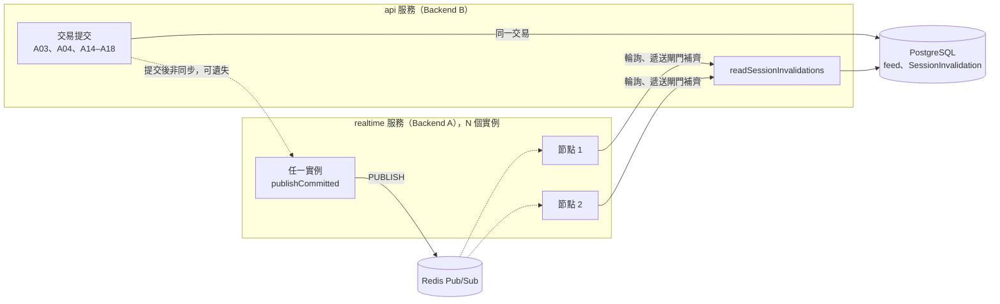
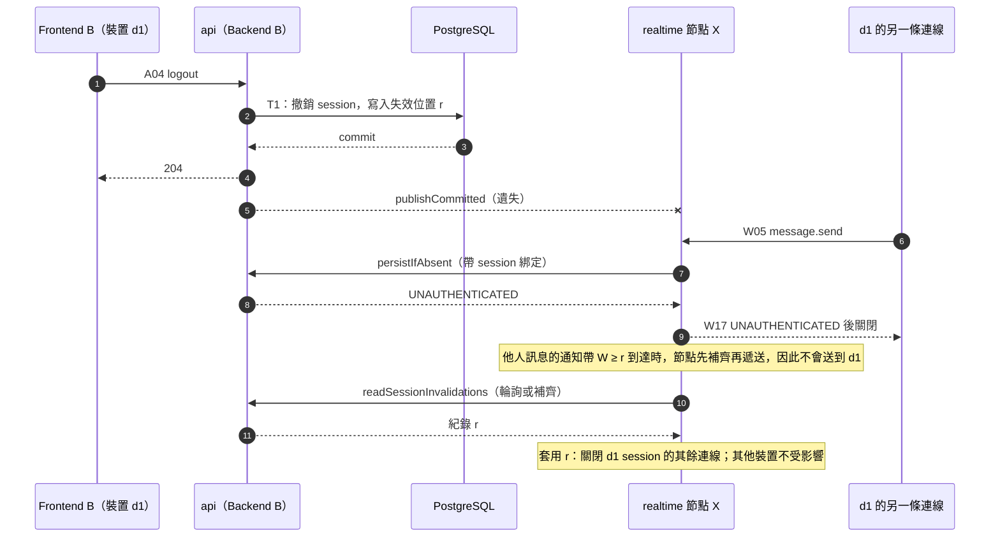
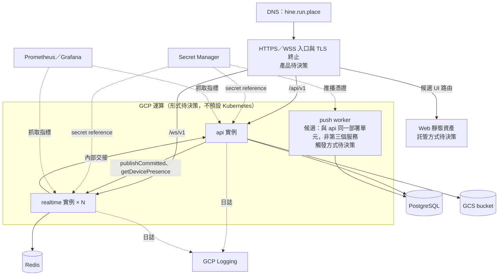

# HINE-IC-0.4 — 系統架構

**狀態：** HINE-IC-0.4 系統架構，待批准。本文描述目標架構與模組邊界，不代表已實作、已部署或已完成測試。介面欄位、事件與錯誤碼以[共同介面契約](../contracts/interface-contract.md)為準；各角色驗收以[角色 PRD](../README.md#按角色閱讀)與[驗收矩陣](../testing/acceptance-matrix.md)為準。本文標示「待決策」的項目集中登錄於[待決策事項](../decisions.md)，在正式決策前不得視為已定案。

[文件導覽](../README.md) · [共同介面契約](../contracts/interface-contract.md) · [Web/RWD 規格](../ui/web-rwd.md#web-rwd) · [待決策事項](../decisions.md)

**來源：** [共同介面契約](../contracts/interface-contract.md)、六份[角色 PRD](../README.md#按角色閱讀)、[Web/RWD 規格](../ui/web-rwd.md#web-rwd)、[專案 README 技術方向](../../README.md#core-technology-direction)、[負載測試規劃](../../tests/load/README.md)，以及 Notion [PM 控制台與團隊協作中心](https://app.notion.com/p/3e9db7b0ff12814c8a79e2a5e383509b)的 PostgreSQL 主資料庫方向。

## 1. 架構原則

1. **先做可展示、可測試、可部署的最小可行產品。** 不預設 Kafka、Cassandra、Kubernetes 或強制微服務。
2. **PostgreSQL 是唯一權威狀態。** 訊息、成員、回條、附件中繼資料、每使用者事件流與推播意圖由後端 B 寫入 PostgreSQL；Redis 只保存短暫狀態並負責即時轉送，不是訊息儲存。
3. **先持久化，再 ACK。** W06 只能在訊息、C1→M1 對應與所有必要事件流列同一交易提交後送出。
4. **即時轉送只為加速，補送保證正確。** Redis Pub/Sub 遺失事件時，由 W15/W16 依每使用者事件流補回；即時 W07 不推進同步游標。
5. **一個 Web 應用只有一條 WSS。** 前端 A 擁有唯一應用程式範圍 WSS；前端 B 擁有 SessionContext 與路由。響應式版面不產生第二套工作階段、連線、游標或 API。
6. **授權在伺服器端重查。** 用戶端傳入的寄件者或 `subject_id` 一律不採信；後端 B 在每次異動交易內重查授權，後端 A 遞送前重查授權。
7. **候選數值不是 SLO。** 心跳、分頁、上傳、速率與效能數值在 PM/QA 批准前都只是候選值。

## 2. 系統脈絡

- 用戶端是**單一響應式 Web 應用**，服務桌面、平板與手機瀏覽器；不推定原生應用程式或 PWA。
- 物件位元組經短效簽署網址直接在瀏覽器與 GCS 之間傳輸，不經過 WSS，也不是 HINE API 路由。
- [A23](../contracts/interface-contract.md#api-a23)/[A24](../contracts/interface-contract.md#api-a24) 只定義 `ios|android` 原生推播權杖。現行基線只有 Web 用戶端，瀏覽器推播尚未核准，因此推播路徑的架構已定義，但實際啟用取決於[Web Push 決策](../decisions.md#decision-web-push)與推播供應商設定。

## 3. 元件與責任邊界

| 元件 | 負責角色 | 負責 | 不負責 |
|---|---|---|---|
| Web 殼層、工作階段與非聊天頁面 | [前端 B](../prd/frontend-b.md) | SessionContext、AccessSession 保存、A02／A03／A04 流程（不讀取更新憑證 Cookie 值）、DeviceStore、路由與深層連結、帳號／個人資料／聯絡人／群組管理頁、呼叫 `openChat` | 建立 WSS、簽發 JWT、定義線上格式 |
| 聊天模組 | [前端 A](../prd/frontend-a.md) | 唯一 WSS 生命週期、W01–W22 用戶端、C1 待送狀態、ACK 合併與去重、SyncCursor 與本機投影、附件訊息、回條 | 更新憑證 Cookie、JWT 簽發、簽署網址、推播派送 |
| `api` 服務 | [後端 B](../prd/backend-b.md) | [A01–A25](../contracts/interface-contract.md#rest-api)、帳號與工作階段權威、JWT 簽發、以 `Set-Cookie` 設定與輪替更新憑證 Cookie、授權決策、PostgreSQL 結構描述與交易、事件流與快照讀取、GCS 授權憑證、推播權杖與推播意圖、推播工作程序 | 持有用戶端連線、把 Redis 當訊息儲存 |
| `realtime` 服務 | [後端 A](../prd/backend-a.md) | [W01–W22](../contracts/interface-contract.md#websocket-events)、WSS 驗證、心跳、使用者線上狀態、裝置活動租期、Redis Pub/Sub 跨節點轉送、同步請求入口、WSS 速率限制與錯誤 | JWT 簽發、授權最終決策、持久化狀態、PostgreSQL 結構描述 |
| 入口、設定、交付與監控 | [維運](../prd/devops.md) | DNS、TLS、路由、機密綁定、GitHub Actions、健康檢查、監控與日誌、可重現的驗證環境 | 產品政策數值的批准 |
| 驗收 | [QA](../prd/qa.md) | 契約、故障注入、隱私、響應式與效能驗收 | 修改共用 API／事件 ID |

`api` 與 `realtime` 之間的[內部交接](../contracts/interface-contract.md#internal-handoffs)是模組契約。候選主方案是兩者**分開部署**：同一個儲存庫、兩個部署單元，內部操作經私有網路 HTTP 呼叫並驗證呼叫者服務身分；推播工作程序與 `api` 屬同一部署單元。這是依現有職責與機密分離分出的兩個服務，不再進一步拆分。同程序部署保留為替代方案。比較與依據見[決策：通知路徑與部署單元](../decisions.md#proposal-notify-topology)，兩者均待批准。

## 4. 資料權威與狀態分類

| 資料 | 權威位置 | 寫入者 | 遺失或故障時 |
|---|---|---|---|
| 訊息、C1→M1 對應 | PostgreSQL | 後端 B（[persistIfAbsent](../contracts/interface-contract.md#internal-persist-if-absent)） | 未提交即無 W06；結果不明回 `OUTCOME_UNCONFIRMED`，用戶端以同一 C1 重試 |
| 對話、成員、角色、`membership_version` | PostgreSQL | 後端 B（A13–A18） | 版本缺口以 A12 重新取得 |
| 送達／已讀回條 | PostgreSQL | 後端 B（[persistReceipt](../contracts/interface-contract.md#internal-persist-receipt)） | 狀態單調；重複回報為 no-op |
| 每使用者事件流 | PostgreSQL | 後端 B，與觸發它的異動同一交易提交 | 離線補送與斷線復原的唯一依據 |
| 附件中繼資料 | PostgreSQL | 後端 B（A20、A21、A25） | 未 `ready` 的附件不可使用 |
| 推播意圖 | PostgreSQL | 後端 B，與訊息同一交易建立 | 供應商失敗時重試意圖，不改動回條 |
| 帳號、工作階段、DeviceID 綁定、推播權杖 | 後端 B（儲存結構描述由後端 B 定義） | 後端 B（A01–A04、A23、A24） | 驗證失敗即關閉；權杖不回傳、不記錄 |
| 附件與頭像位元組 | GCS | 瀏覽器經簽署網址 | A21 驗證實際型別、大小與雜湊後才 `ready` |
| 使用者線上狀態、連線登錄 | Redis | 後端 A | 無法確認時回報 `unknown` |
| 裝置活動租約（提案） | Redis | 後端 A（[recordActivity](../contracts/interface-contract.md#internal-record-activity)） | 過期或 Redis 故障即 `unknown`，不可視為前景 |
| Pub/Sub 即時事件 | Redis（不保存） | 後端 A | 由 W15/W16 補回 |
| SessionContext、AccessSession | 瀏覽器（FB 工作階段狀態；存取權杖不寫入任何持久儲存） | 前端 B（FA 只消費 FB 交付的 AccessSession） | 遺失時依 FB 認證流程重新取得或要求登入 |
| 更新憑證 Cookie | 瀏覽器 Cookie 儲存（HttpOnly/Secure/SameSite） | 後端 B 以 `Set-Cookie` 設定、輪替與判定；瀏覽器保存並在 A03／A04 自動附帶 | 前端程式碼不可讀取或保存其值；FB 只決定何時呼叫 A02／A03／A04（[分工](../contracts/interface-contract.md#refresh-cookie-roles)） |
| DeviceStore | 瀏覽器（安裝範圍） | 前端 B | 遺失或不可重用時採用伺服器回傳的 DeviceID |
| SyncCursor、本機投影、待送 C1 | 瀏覽器 | 前端 A | 游標只在完整套用投影後原子保存 |

## 5. 識別碼、去重與排序

| 識別碼 | 產生者 | 用途 | 限制 |
|---|---|---|---|
| `client_message_id`（C1，UUID） | 傳送端前端 A，每個傳送意圖一次 | 冪等與去重；斷線或 ACK 遺失時沿用 | 同一意圖重試不得換新 C1；同 C1 不同內容回 `IDEMPOTENCY_CONFLICT` |
| `message_id`（M1，UUID） | 後端 B | 標準訊息 ID；即時、歷史與同步中一致 | — |
| 訊息 `event_id`（UUID） | 後端 B，於提交時產生 | 即時 W07 與 W16 重播使用同一值，用戶端據此去重 | — |
| 請求 `event_id`、`correlation_id` | 送出請求的一方 | 回應以 `correlation_id` 對應請求 | 每次嘗試不同，不可取代 C1 |
| `order_key` | 後端 B，於提交時產生 | 對話內訊息排序；A19 由新到舊排序 | 不是同步游標；固定 20 位 ASCII 十進位格式與元組次排序比較屬待批准 [C11](../contracts/interface-contract.md#ordering-pagination) |
| SyncCursor（`OpaqueCursor`） | 後端 B | 每使用者事件流進度（W15/W16） | 不可解碼；不可與 REST 游標或 歷史 `before` 互換 |
| `snapshot_id`、起始游標 H | 後端 B | W13/W14 一致快照與快照後續傳起點 | 同一快照全部頁面套用前不得安裝 H |
| REST 游標、歷史 `before` | 後端 B | A08、A11、A19 各自分頁 | 錯誤只重啟該查詢，不觸發 W13 |
| `session_generation` | 後端 B | 辨識舊連線與舊活動回報 | — |
| `DeviceID` | 後端 B | 裝置綁定 | 不是憑證 |

## 6. 關鍵流程

### 6.1 連線、驗證與重連補送

- W01 必須是第一個業務訊框；存取權杖放在 W01 承載資料，不放在 URL。
- W03/W04 只代表連線存活，不延長 JWT，也不代表應用程式在前景；W21/W22 活動與 W18 使用者線上狀態是不同狀態。
- [A03](../contracts/interface-contract.md#api-a03) 更新成功後，前端 A 關閉舊 WSS、建立新 WSS，並從已保存游標續傳；不支援同一連線重新驗證。
- 前景期間依 `SYNC_RECONCILE_SECONDS` 定期送 W15 對帳；數值待批准。

### 6.2 訊息傳送、持久化 ACK 與跨節點扇出

- W06 與 W07 沒有先後保證；前端 A 依 C1 與 `message_id` 合併成同一則可見訊息。
- `persisted` 只代表已持久化，不代表送達或已讀。W08/W09 經 [persistReceipt](../contracts/interface-contract.md#internal-persist-receipt) 寫入後，每次都以 W19 回覆請求者（重複請求可能是 `changed:false`）。W10 只在狀態實際改變、`status_event_id` 非 null 時產生，投影給該回條的觀察者（候選 C4 `observer_ids`）；`status_event_id:null` 不發 W10。群組已讀彙總未啟用時，群組訊息不發 W10，只有個別 W08／W09／W19。見[回條交接](../contracts/interface-contract.md#receipt-projection-handoff)。
- Pub/Sub 頻道的切分方式屬後端 A 內部設計。收件者一律採用後端 B 在提交交易內決定的清單，節點遞送前依 `invalidation_position` 補齊工作階段失效紀錄；不得以快取的成員名單或 `authorize` 結果決定收件者（[BA-05](../prd/backend-a.md#ba-05)、[6.6](#flow-invalidation)，候選）。

### 6.3 REST 群組異動與即時事件

- 事件對應固定為 A14/A16→W11、A15/A17→W20、A18→W12；沒有封鎖操作。
- 候選主方案：後端 B 提交成功後，呼叫任一 `realtime` 實例的 [`publishCommitted`](../contracts/interface-contract.md#internal-publish-committed)，由該實例發布到 Redis Pub/Sub，所有實例各自遞送。呼叫時機依執行環境（[T1](../contracts/interface-contract.md#internal-transaction-order)）。REST 結果只取決於提交。通知失敗時，群組事件由事件流補回；收件者在提交時就已決定，所以無權成員收不到撤權後的正文。A03／A04 的工作階段失效走同一條通知路徑，但正確性另由失效紀錄保證，見 [6.6](#flow-invalidation)。待批准，見[決策](../decisions.md#proposal-notify-topology)。

### 6.4 附件上傳、續期與下載

- A21 回 ready 後分兩條路徑：`scope=conversation` 才送 W05；頭像使用 `scope=avatar`、`conversation_id:null`，以 A06 指派，不送 W05，也無須任何對話。
- C10（待批准）：A21 核驗並綁定同一物件世代與中繼資料，A22 只為該已核驗版本簽署下載網址，版本不可用時失敗而不改送最新版本；細節見[簽署上傳交接](../contracts/interface-contract.md#signed-upload-contract)與[就緒不變條件](../contracts/interface-contract.md#attachment-ready-invariant)。
- 簽署網址與 GCS 物件鍵（object_key）不得寫入訊息、事件或日誌。

### 6.5 背景推播（提案）

推播只是提示，不是送達或已讀證據。使用者點開通知後，先恢復驗證，再經 W13–W16 或 A19 取得有權限的內容。

### 6.6 授權失效、連線清理與通知傳遞（候選，待批准）

三件事分開定義。時點術語、順序定義、D1–D4 規則、交付與連線狀態表、型別、操作與節點規則，見[共同契約候選小節](../contracts/interface-contract.md#internal-notify-invalidation)。本節只摘要，不另立規則。

| 保證 | 判定或完成條件 | 依據 | 通知遺失時 |
|---|---|---|---|
| 授權失效：撤銷後的資料（D1） | 授權點在撤銷 R 之後的資料，永不交付給 R 撤銷的對象 | 提交序：工作階段撤銷以 `W ≥ r` 判定，群組撤權以對話列鎖判定 | 不受影響 |
| 授權失效：撤銷前的資料（D2、D3） | 工作階段依開始交付前的未失效／新鮮／權杖檢查；群組待送內容主要推薦既有 E1，不能與裝置副本或新查詢權限合併批准 | [D2 與 E1](../contracts/interface-contract.md#group-revocation-e1) | 工作階段的 S 候選 15 秒；不採 E1 的群組內容無相對 A18 固定停止上限（60 秒只是紀錄保留窗）；E1 批准並整合後才適用同一 S，均不是抵達期限 |
| 授權失效：新操作（D4） | R 之後的舊身分操作被拒 | 交易內工作階段檢查；W21 需先補齊 | 不受影響 |
| 連線清理 | 各節點將連線標記失效並關閉；沒有全域完成回報 | 通知、每 `INVALIDATION_POLL_SECONDS` 輪詢、遞送閘門補齊、存取權杖到期 | 後端 B 可連線時，最遲在下一次輪詢的完整補齊並套用後完成（輪詢間隔加一次補齊）。不可連線時依[狀態表](../contracts/interface-contract.md#delivery-state-table)：仍新鮮時連線保留、撤銷前資料可交付、需補齊的事件逾時放棄（第 6 列）；不新鮮後只送 W04／W17、不交付資料（第 7 列）；兩者最遲都在存取權杖到期時關閉 |
| 通知傳遞 | 盡力傳遞 | `publishCommitted` → Redis Pub/Sub | 群組事件由事件流補回；工作階段失效由失效紀錄補回 |

- 「多久內關閉連線」只是清理時間，不能代替資料交付政策。群組撤權分為[裝置已有／服務端待送／撤權後新查詢](../decisions.md#behavior-approval)三項，E1 僅是待送內容的主要推薦；原文是比較基準，沒有本輪實作授權。
- 順序以 PostgreSQL 提交序判定。資料的位置是它的授權點，不是它的提交；與撤銷並行、授權點在撤銷之前的交易，屬於 D2，不另立例外。
- W18 線上狀態不是獨立例外：它沒有後端 B 的授權點，視為節點最近一次完整補齊時授權，適用 D2 的同一上限。
- 保留連線不等於允許送資料：節點不新鮮時，連線保留，但只送 W04 與 W17。
- A03 只使舊世代連線失效；A04 只撤銷目前裝置的工作階段；A02 重新登入會撤銷同帳號同裝置原有的工作階段（候選 C5，行為變更）；A18 只影響該對話，不關閉連線。本方案沒有以使用者為範圍關閉所有連線的操作。
- 應用程式範圍 WSS 指每個分頁一條連線，不是整個瀏覽器共用一條；[FB 交接](../prd/frontend-b.md#fb-multi-tab)與 [C6](../contracts/interface-contract.md#refresh-recovery-policy) 統一無寬限、一次恢復的候選流程；[C7](../contracts/interface-contract.md#activity-merge) 按各連線租期合併 W21，非最後一筆覆蓋裝置。均待批准。
- 使用者事件流涵蓋 W07、W10、W11、W12、W20，不含工作階段失效；工作階段失效另存於候選的 SessionInvalidation 紀錄，不回傳給用戶端。

A04 撤銷且通知遺失：

圖中後端 B 回的 `UNAUTHENTICATED` 指使用者工作階段層（候選 [C13](../contracts/interface-contract.md#internal-auth-layer)：可信回應且 `details.auth_layer:"user_session"`），節點只關閉這次呼叫所屬的連線；服務身分層、缺少分層或非可信回應按依賴失敗回 W17 `DEPENDENCY_UNAVAILABLE`：已驗證連線不因此關線（仍依狀態表與生命週期），新 W01 則不回 W02 並關閉未驗證連線，不宣稱工作階段已撤銷。

## 7. 部署拓樸

| 路徑 | 目的地 | 公開 | 說明 |
|---|---|---|---|
| `https://hine.run.place/api/v1/...` | `api` | 是 | [A01–A25](../contracts/interface-contract.md#rest-api) |
| `wss://hine.run.place/ws/v1` | `realtime` | 是 | [W01–W22](../contracts/interface-contract.md#websocket-events) |
| `/`、`/login`、`/register`、`/contacts`、`/chats`、`/chats/{conversation_id}`、`/profile`、`/groups/{conversation_id}/manage` | Web 殼層 | 是（候選） | [DO-06](../prd/devops.md#do-06)；`/` 只負責導向，見[根路徑規則](../ui/web-rwd.md#rwd-root-route)（候選）；不得把 `/api/v1`、`/ws/v1` 改寫到 Web 殼層 |
| `/health/live`、`/health/ready` | 各服務 | 否 | 內部健康檢查，回應格式見 [HealthResponse](../contracts/interface-contract.md#data-dictionary) |
| `/internal/v1/*` | `api`、`realtime` | 否 | 候選內部操作；公開入口不得轉送，呼叫者憑證由應用程式驗證 |
| GCS 簽署網址 | GCS | 短效 | 不是 HINE API 路由 |

**架構約束：**

- `realtime` 可水平擴展；任一節點都能接受任一使用者的連線。跨節點遞送經 Redis Pub/Sub，補送經 PostgreSQL 事件流，因此重連不需要黏性工作階段。
- 入口必須支援 WebSocket 升級，閒置逾時必須大於 `HEARTBEAT_INTERVAL_SECONDS`，否則正常連線會被入口切斷。
- `realtime` 實例被替換或關閉時（部署新修訂版、平台維護或實例重啟），該實例上的連線最終會結束；用戶端依 [6.1](#flow-connect) 重連，並從已保存游標續傳。
- 只有後端 B 取得 JWT 簽章金鑰；`DATABASE_URL`、`REDIS_URL`、JWT 與推播供應商憑證都以 Secret Manager 參照注入。完整設定表見[部署設定](../contracts/interface-contract.md#deployment-config)。
- 候選主方案中 `api` 與 `realtime` 分開部署：只部署 `api` 時不會替換 `realtime` 實例，WSS 連線不需遷移。部署 `realtime` 新修訂版時，新連線導向新修訂版，舊修訂版上的連線最晚在請求逾時或實例關閉時結束，用戶端依 [6.1](#flow-connect) 重連；實際重連量未量測。`realtime` 的平台請求逾時不得短於存取權杖最長有效期，否則連線會在權杖到期前被切斷，多一次重連。平台條件見 [GCP 執行環境方案](../decisions.md#proposal-runtime-platform)。
- GCP 運算形式、PostgreSQL／Redis 託管方式、入口產品、Web 資產託管、Prometheus 部署方式與環境清單的候選主方案（Cloud Run 兩個服務、Cloud SQL for PostgreSQL、Memorystore for Redis）見 [GCP 執行環境方案](../decisions.md#proposal-runtime-platform)，待批准。

## 8. 失效模式與降級

| 情境 | 系統行為 | 正確性依據 |
|---|---|---|
| `realtime` 節點當機或連線中斷 | 用戶端建立新 WSS 連到任一節點，W01/W02 後以已保存游標送 W15 | PostgreSQL 事件流 |
| Redis 無法使用 | 線上狀態與活動回報 `unknown`；`realtime` 的 `/health/ready` 回 503；即時扇出中斷 | 已提交訊息由 W15/W16 補回 |
| PostgreSQL 無法使用或交易回滾 | 不送 W06；回 `PERSISTENCE_FAILED` 或 `DEPENDENCY_UNAVAILABLE`；`api` 的 `/health/ready` 回 503 | 未提交即不宣告成功 |
| 已提交但 ACK 遺失 | 用戶端以同一 C1 重送 | 回傳同一 M1（`existing_same`） |
| 寫入結果不明 | 回 `OUTCOME_UNCONFIRMED` | 以同一 C1 重試確認 |
| Pub/Sub 發布或轉送遺失 | 不影響 W06 | W15/W16 補回 |
| 事件流游標過期 | W17 `SYNC_RESET_REQUIRED`，改走 W13/W14 | 一致快照 |
| REST 游標過期或無效 | 只重啟該 REST 查詢 | 不影響事件流游標 |
| GCS 無法使用 | A22 回 `DEPENDENCY_UNAVAILABLE`；文字訊息不受影響 | 附件中繼資料仍在 PostgreSQL |
| 推播供應商失敗 | 可重試錯誤時重試意圖；永久失敗時撤銷該權杖綁定 | 回條不變 |
| 存取權杖過期或 A03 更新 | 關閉舊 WSS，建立新 WSS | 從已保存游標續傳 |
| 慢速消費者 | 限制每條連線的輸出量（[BA-08](../prd/backend-a.md#ba-08)） | 未送達內容由事件流補回 |
| 後端 B 提交後通知失敗（`publishCommitted` 或 Pub/Sub 遺失） | REST 照常回成功；群組事件不即時送達 | 事件流（W15/W16）；收件者在提交時決定 |
| 工作階段失效通知遺失 | 失效連線的新操作在後端 B 被拒；撤銷後的資料被遞送閘門擋下；撤銷前的資料最晚在撤銷提交後 `INVALIDATION_STALE_SECONDS` 停止；後端 B 可連線時，各節點最遲在下一次輪詢的完整補齊並套用後關線（輪詢間隔加一次補齊，同 [6.6](#flow-invalidation)）；不可連線時依狀態表第 6–8 列 | SessionInvalidation 紀錄（候選）；[狀態表](../contracts/interface-contract.md#delivery-state-table)第 4、5 列 |
| `realtime` 無法連到後端 B | **仍新鮮（狀態表第 6 列）：** 連線保留；經後端 B 的操作回錯誤、不回成功；新 W01 被拒；撤銷前資料可交付到新鮮期滿；需補齊的事件逾時後放棄即時遞送。**不新鮮（第 7 列）：** 連線保留但只送 W04 與 W17；新 W01、W21 回 W17 `DEPENDENCY_UNAVAILABLE`；不交付任何資料。**恢復（第 8 列）：** 先完整補齊再恢復交付。最遲在存取權杖到期時關閉 | 不假定仍有權；[狀態表](../contracts/interface-contract.md#delivery-state-table)第 6–8 列 |
| 節點的失效位置早於保留範圍 | 關閉該節點所有連線，從最新位置重新開始 | 用戶端重連時重新驗證 |

## 9. 安全架構

- 所有公開流量使用 HTTPS/WSS；健康檢查不公開。
- REST 使用 Bearer 存取 JWT；WSS 在 W01 承載資料傳存取權杖。更新憑證只存在 HttpOnly/Secure/SameSite Cookie，不出現在 JSON：由後端 B 設定、瀏覽器保存與附帶，前端程式碼不可讀取；FB 管理 AccessSession 與認證流程，FA 只消費 AccessSession。
- 後端 A 經 [validateAccess](../contracts/interface-contract.md#internal-validate-access) 驗證簽章、簽發者／受眾、裝置綁定與撤銷狀態；只有後端 B 持有 JWT 簽章金鑰。
- 內部 `subject_id` 不進入任何用戶端欄位；公開身分只使用 `user_id`。
- 後端 B 在異動交易內重查授權與工作階段；後端 A 只遞送給後端 B 在提交時決定的收件者，並在遞送前補齊工作階段失效紀錄（候選，見 [6.6](#flow-invalidation)）。被移除的成員只收到自己的最小 W12 通知，不再收到後續內文。
- 候選內部操作走私有網路 `/internal/v1/*`，以平台服務身分驗證呼叫者；公開入口不轉送。
- 簽署網址為短效，只發給有權限者；A21 驗證實際位元組；A22 每次重查授權。
- 日誌與指標不得包含完整權杖、密碼、訊息內文、簽署網址或高基數的使用者 ID 標籤。
- 速率限制、上傳大小與 MIME 允許清單為候選值，見[營運上限決策](../decisions.md#decision-operational-values)與[附件政策決策](../decisions.md#decision-attachment-policy)。

## 10. 可觀測性

- `/health/live` 只回報程序存活（200，依賴可為 `not_checked`）；`/health/ready` 回報必要依賴是否就緒（200 或 503）。`HealthResponse.service` 區分 `api` 與 `realtime`。
- 監控訊號：ACK 延遲、即時遞送、同步復原、活動過期、推播失敗、依賴就緒狀態。指標以 Prometheus 蒐集、Grafana 呈現，日誌進入 GCP Logging（[DO-04](../prd/devops.md#do-04)）。
- 缺少設定時以 `CONFIG_MISSING` 等公開安全原因診斷，不揭露設定名稱或值。

## 11. 交付流程與環境

- 目前 [`repository-checks.yml`](../../.github/workflows/repository-checks.yml) 只檢查專案結構與常見機密檔名。
- 目標流程（[DO-03](../prd/devops.md#do-03)）：PR 檢查 → 受控測試環境部署 → 健康檢查／REST／WSS 冒煙測試 → 經授權的正式環境升版，並保留可回滾版本。
- `HINE_ENV` 區分環境；環境名稱、數量與各環境的設定來源屬[待決策：GCP 執行環境](../decisions.md#decision-runtime-platform)。

## 12. 容量與效能驗證

- [負載測試規劃](../../tests/load/README.md)依 1,000 → 5,000 → 10,000 條 WebSocket 連線分階段量測連線數與訊息吞吐量。這些是測試階段，不是已核准的容量目標或 SLO。
- 效能結果必須記錄軟體版本、運算資源、網路、資料庫連線池、Redis 與設定版本（[DO-05](../prd/devops.md#do-05)）；未量測的規模不得宣稱通過（[REQ-18](../testing/acceptance-matrix.md#req-18)）。
- 歷史效能目標是否仍有效見[歷史效能目標決策](../decisions.md#decision-historical-slos)；負載測試工具的候選主方案（Artillery）見[負載測試工具方案](../decisions.md#proposal-load-tool)。

## 13. 程式碼目錄對應

| 目錄 | 負責角色 | 對應架構元件 |
|---|---|---|
| `frontend/app/auth/`、`frontend/app/contacts/`、`frontend/app/profile/` | 前端 B | Web 殼層、工作階段與非聊天頁面 |
| `frontend/app/chat/` | 前端 A | 聊天模組與唯一 WSS |
| `backend/api/` | 後端 B | `api` 服務 |
| `backend/realtime/` | 後端 A | `realtime` 服務 |
| `backend/common/` | 後端 A 與後端 B | 後端共用型別、常數、驗證與領域定義 |
| `infra/docker/`、`infra/gcp/`、`infra/monitoring/`、`infra/scripts/` | 維運 | 本機開發容器、GCP 設定、監控與維運腳本 |
| `.github/workflows/` | 維運 | CI/CD |
| `tests/integration/`、`tests/e2e/`、`tests/load/` | QA | 整合、端對端與負載測試 |

前後端框架與程式語言的候選主方案（全端 TypeScript）見[技術棧方案](../decisions.md#proposal-tech-stack)，待批准。

## 14. 架構待決策

| 決策 | 影響的架構區塊 | 候選主方案（待批准） |
|---|---|---|
| [GCP 執行環境與託管服務](../decisions.md#decision-runtime-platform) | 部署拓樸、交付流程、效能驗證環境 | [Cloud Run 兩個服務、Cloud SQL、Memorystore](../decisions.md#proposal-runtime-platform) |
| [前後端框架與程式語言](../decisions.md#decision-tech-stack) | 程式碼結構、共用型別、CI 建置 | [全端 TypeScript](../decisions.md#proposal-tech-stack) |
| [`api`／`realtime` 部署單元與內部呼叫方式](../decisions.md#decision-service-topology) | 元件邊界、ACK 路徑延遲、推播工作程序 | [分開部署，私有網路 HTTP](../decisions.md#proposal-notify-topology) |
| [REST 寫入後的即時通知與授權失效](../decisions.md#decision-realtime-notify) | 群組事件、工作階段失效、連線清理 | [`publishCommitted` 經 Redis 分發；正確性由 PostgreSQL 保證](../decisions.md#proposal-notify-topology) |
| [負載測試工具](../decisions.md#decision-load-tool) | 容量驗證 | [Artillery](../decisions.md#proposal-load-tool) |
| [營運上限與速率](../decisions.md#decision-operational-values) | 心跳、分頁、上傳、速率限制 | — |
| [活動租約與未知狀態推播受眾](../decisions.md#decision-activity-push) | 線上狀態、推播 | — |
| [Web Push 範圍與供應商](../decisions.md#decision-web-push) | 推播路徑是否在 Web 用戶端啟用 | — |
| [歷史效能與重連目標](../decisions.md#decision-historical-slos) | 容量驗收門檻 | — |

## 15. 不在本架構範圍

- Kafka、Cassandra、Kubernetes 或強制微服務拆分。
- 以 Redis 作為訊息儲存或 ACK 依據。
- 原生應用程式、PWA／完整離線產品，以及未經核准的瀏覽器推播。這些非目標不排除既有本機持久保存義務：W05 前保存 C1／承載資料、W08 前持久保存已收訊息及其識別資訊（不需先取得伺服器回條）、投影與 SyncCursor 原子保存，完整 W14 後才安裝 H；見[本地保存邊界](../contracts/interface-contract.md#local-persistence-boundary)。這不是新增離線產品批准，也不指定本地儲存技術。
- 同一連線重新驗證，或因響應式版面建立第二條 WSS。
- 群組封鎖操作。
