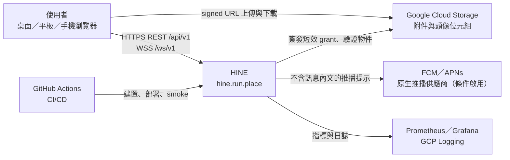
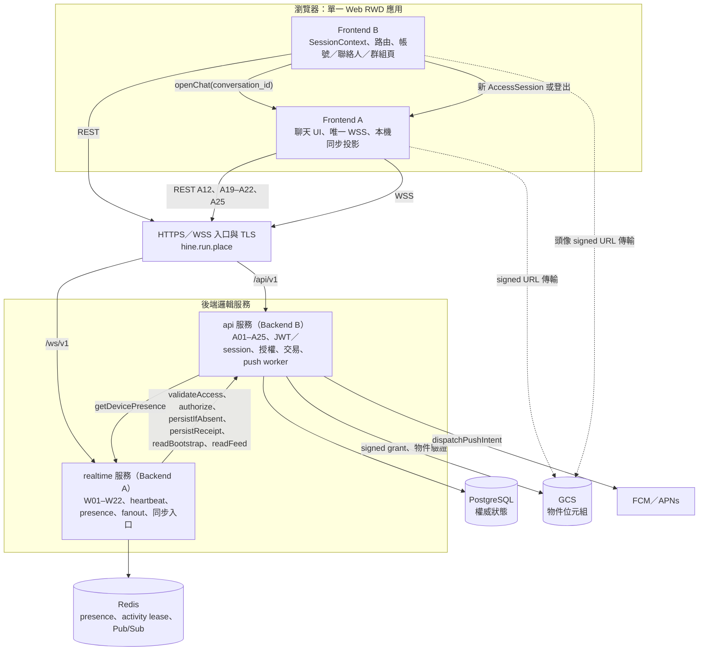
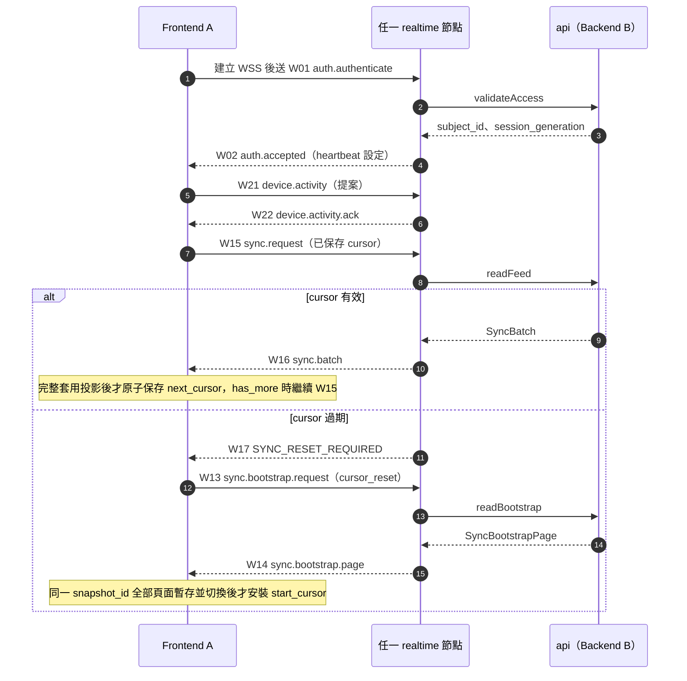
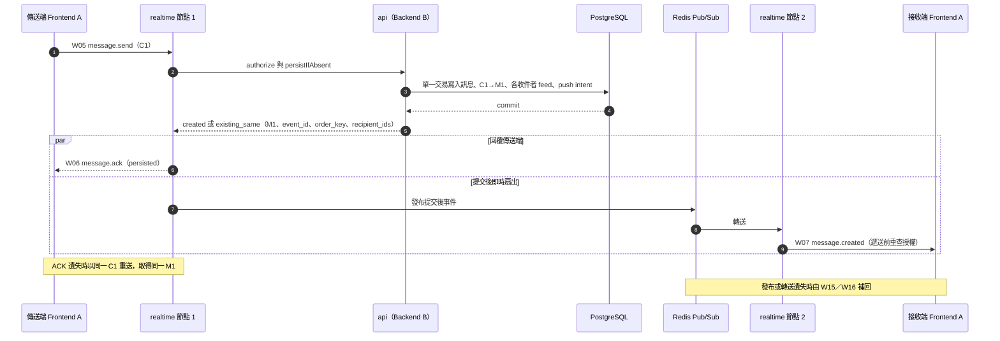
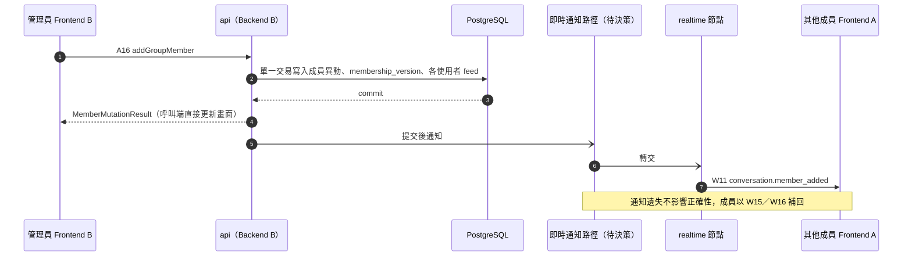
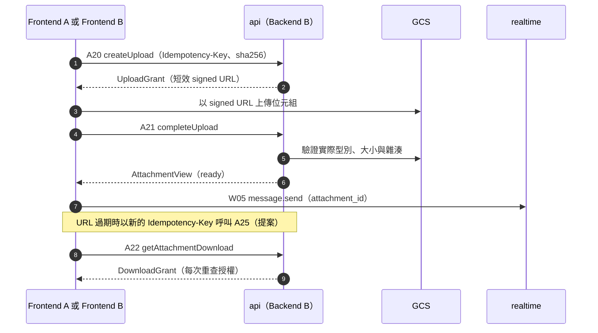
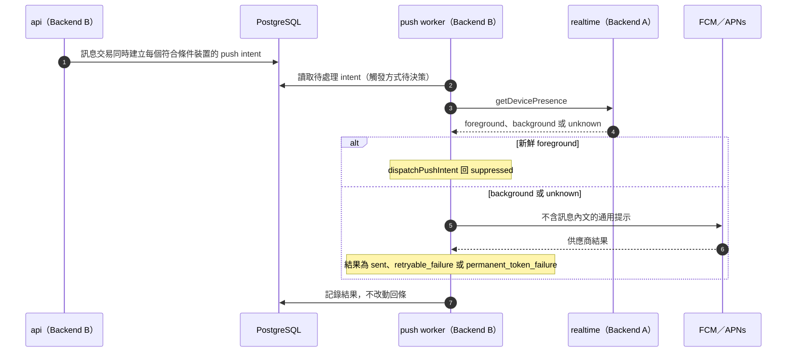
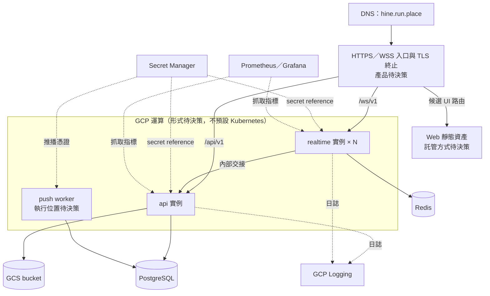

# HINE-IC-0.4 — 系統架構

**狀態：** HINE-IC-0.4 系統架構，待批准。本文描述目標架構與模組邊界，不代表已實作、已部署或已完成測試。介面欄位、事件與錯誤碼以[共同介面契約](../contracts/interface-contract.md)為準；各角色驗收以[角色 PRD](../README.md#按角色閱讀)與[驗收矩陣](../testing/acceptance-matrix.md)為準。本文標示「待決策」的項目集中登錄於[待決策事項](../decisions.md)，在正式決策前不得視為已定案。

[文件導覽](../README.md) · [共同介面契約](../contracts/interface-contract.md) · [Web/RWD 規格](../ui/web-rwd.md#web-rwd) · [待決策事項](../decisions.md)

**來源：** [共同介面契約](../contracts/interface-contract.md)、六份[角色 PRD](../README.md#按角色閱讀)、[Web/RWD 規格](../ui/web-rwd.md#web-rwd)、[專案 README 技術方向](../../README.md#core-technology-direction)、[負載測試規劃](../../tests/load/README.md)，以及 Notion [PM 控制台與團隊協作中心](https://app.notion.com/p/3e9db7b0ff12814c8a79e2a5e383509b)的 PostgreSQL 主資料庫方向。

## 1. 架構原則

1. **先做可展示、可測試、可部署的 MVP。** 不預設 Kafka、Cassandra、Kubernetes 或強制微服務。
2. **PostgreSQL 是唯一權威狀態。** 訊息、成員、回條、附件 metadata、每使用者 feed 與推播 intent 由 Backend B 寫入 PostgreSQL；Redis 只保存短暫狀態並負責即時轉送，不是訊息儲存。
3. **先持久化，再 ACK。** W06 只能在訊息、C1→M1 對應與所有必要 feed 列同一交易提交後送出。
4. **即時轉送只為加速，補送保證正確。** Redis Pub/Sub 遺失事件時，由 W15/W16 依每使用者 feed 補回；即時 W07 不推進同步 cursor。
5. **一個 Web 應用只有一條 WSS。** Frontend A 擁有唯一 app-scoped WSS；Frontend B 擁有 SessionContext 與路由。響應式版面不產生第二套 session、socket、cursor 或 API。
6. **授權在伺服器端重查。** 用戶端傳入的 sender 或 `subject_id` 一律不採信；Backend B 在每次異動交易內重查授權，Backend A 遞送前重查授權。
7. **候選數值不是 SLO。** heartbeat、分頁、上傳、速率與效能數值在 PM/QA 批准前都只是候選值。

## 2. 系統脈絡

- 用戶端是**單一響應式 Web 應用**，服務桌面、平板與手機瀏覽器；不推定原生 App 或 PWA。
- 物件位元組經短效 signed URL 直接在瀏覽器與 GCS 之間傳輸，不經過 WSS，也不是 HINE API 路由。
- [A23](../contracts/interface-contract.md#api-a23)/[A24](../contracts/interface-contract.md#api-a24) 只定義 `ios|android` 原生推播 token。現行基線只有 Web 用戶端，瀏覽器推播尚未核准，因此推播路徑的架構已定義，但實際啟用取決於[Web Push 決策](../decisions.md#decision-web-push)與推播供應商設定。

## 3. 元件與責任邊界

| 元件 | 負責角色 | 負責 | 不負責 |
|---|---|---|---|
| Web 殼層、session 與非聊天頁面 | [Frontend B](../prd/frontend-b.md) | SessionContext、refresh cookie 流程、DeviceStore、路由與 deep link、帳號／個人資料／聯絡人／群組管理頁、呼叫 `openChat` | 建立 WSS、簽發 JWT、定義 wire format |
| 聊天模組 | [Frontend A](../prd/frontend-a.md) | 唯一 WSS 生命週期、W01–W22 用戶端、C1 待送狀態、ACK 合併與去重、SyncCursor 與本機投影、附件訊息、回條 | refresh cookie、JWT 簽發、signed URL 簽署、推播派送 |
| `api` 服務 | [Backend B](../prd/backend-b.md) | [A01–A25](../contracts/interface-contract.md#rest-api)、帳號與 session 權威、JWT 簽發、授權決策、PostgreSQL schema 與交易、feed 與快照讀取、GCS grant、push token 與 push intent、push worker | 持有用戶端 socket、把 Redis 當訊息儲存 |
| `realtime` 服務 | [Backend A](../prd/backend-a.md) | [W01–W22](../contracts/interface-contract.md#websocket-events)、WSS 驗證、heartbeat、使用者 presence、裝置 activity lease、Redis Pub/Sub 跨節點轉送、同步請求入口、WSS 速率限制與錯誤 | JWT 簽發、授權最終決策、持久化狀態、PostgreSQL schema |
| 入口、設定、交付與監控 | [DevOps](../prd/devops.md) | DNS、TLS、路由、secret 綁定、GitHub Actions、健康檢查、監控與日誌、可重現的驗證環境 | 產品政策數值的批准 |
| 驗收 | [QA](../prd/qa.md) | 契約、故障注入、隱私、響應式與效能驗收 | 修改共用 API／事件 ID |

`api` 與 `realtime` 之間的[內部交接](../contracts/interface-contract.md#internal-handoffs)是模組契約，不是公開端點，也不強制拆成微服務。兩者部署成同一程序或獨立服務、內部呼叫方式，以及 push worker 的執行位置，均屬[待決策：api／realtime 部署單元](../decisions.md#decision-service-topology)。

## 4. 資料權威與狀態分類

| 資料 | 權威位置 | 寫入者 | 遺失或故障時 |
|---|---|---|---|
| 訊息、C1→M1 對應 | PostgreSQL | Backend B（[persistIfAbsent](../contracts/interface-contract.md#internal-persist-if-absent)） | 未提交即無 W06；結果不明回 `OUTCOME_UNCONFIRMED`，用戶端以同一 C1 重試 |
| 對話、成員、角色、`membership_version` | PostgreSQL | Backend B（A13–A18） | 版本缺口以 A12 重新取得 |
| 送達／已讀回條 | PostgreSQL | Backend B（[persistReceipt](../contracts/interface-contract.md#internal-persist-receipt)） | 狀態單調；重複回報為 no-op |
| 每使用者 feed | PostgreSQL | Backend B，與觸發它的異動同一交易提交 | 離線補送與斷線復原的唯一依據 |
| 附件 metadata | PostgreSQL | Backend B（A20、A21、A25） | 未 `ready` 的附件不可使用 |
| push intent | PostgreSQL | Backend B，與訊息同一交易建立 | 供應商失敗時重試 intent，不改動回條 |
| 帳號、session、DeviceID 綁定、push token | Backend B（儲存 schema 由 Backend B 定義） | Backend B（A01–A04、A23、A24） | 驗證失敗即關閉；token 不回傳、不記錄 |
| 附件與頭像位元組 | GCS | 瀏覽器經 signed URL | A21 驗證實際型別、大小與雜湊後才 `ready` |
| 使用者 presence、連線登錄 | Redis | Backend A | 無法確認時回報 `unknown` |
| 裝置 activity lease（提案） | Redis | Backend A（[recordActivity](../contracts/interface-contract.md#internal-record-activity)） | 過期或 Redis 故障即 `unknown`，不可視為 foreground |
| Pub/Sub 即時事件 | Redis（不保存） | Backend A | 由 W15/W16 補回 |
| SessionContext、refresh cookie | 瀏覽器 | Frontend B | refresh 憑證只存在 HttpOnly/Secure/SameSite cookie |
| DeviceStore | 瀏覽器（安裝範圍） | Frontend B | 遺失或不可重用時採用伺服器回傳的 DeviceID |
| SyncCursor、本機投影、待送 C1 | 瀏覽器 | Frontend A | cursor 只在完整套用投影後原子保存 |

## 5. 識別碼、去重與排序

| 識別碼 | 產生者 | 用途 | 限制 |
|---|---|---|---|
| `client_message_id`（C1，UUID） | 傳送端 Frontend A，每個傳送意圖一次 | 冪等與去重；斷線或 ACK 遺失時沿用 | 同一意圖重試不得換新 C1；同 C1 不同內容回 `IDEMPOTENCY_CONFLICT` |
| `message_id`（M1，UUID） | Backend B | 標準訊息 ID；即時、歷史與同步中一致 | — |
| 訊息 `event_id`（UUID） | Backend B，於提交時產生 | 即時 W07 與 W16 重播使用同一值，用戶端據此去重 | — |
| 請求 `event_id`、`correlation_id` | 送出請求的一方 | 回應以 `correlation_id` 對應請求 | 每次嘗試不同，不可取代 C1 |
| `order_key` | Backend B，於提交時產生 | 對話內訊息排序；A19 由新到舊排序 | 不是同步 cursor |
| SyncCursor（`OpaqueCursor`） | Backend B | 每使用者 feed 進度（W15/W16） | 不可解碼；不可與 REST cursor 或 history `before` 互換 |
| `snapshot_id`、start cursor H | Backend B | W13/W14 一致快照與快照後續傳起點 | 同一快照全部頁面套用前不得安裝 H |
| REST cursor、history `before` | Backend B | A08、A11、A19 各自分頁 | 錯誤只重啟該查詢，不觸發 W13 |
| `session_generation` | Backend B | 辨識舊連線與舊 activity 回報 | — |
| `DeviceID` | Backend B | 裝置綁定 | 不是憑證 |

## 6. 關鍵流程

### 6.1 連線、驗證與重連補送

- W01 必須是第一個業務 frame；access token 放在 W01 payload，不放在 URL。
- W03/W04 只代表連線存活，不延長 JWT，也不代表 App 在前景；W21/W22 activity 與 W18 使用者 presence 是不同狀態。
- [A03](../contracts/interface-contract.md#api-a03) 更新成功後，Frontend A 關閉舊 WSS、建立新 WSS，並從已保存 cursor 續傳；不支援同一 socket 重新驗證。
- 前景期間依 `SYNC_RECONCILE_SECONDS` 定期送 W15 對帳；數值待批准。

### 6.2 訊息傳送、持久化 ACK 與跨節點扇出

- W06 與 W07 沒有先後保證；Frontend A 依 C1 與 `message_id` 合併成同一則可見訊息。
- `persisted` 只代表已持久化，不代表送達或已讀。W08/W09 經 [persistReceipt](../contracts/interface-contract.md#internal-persist-receipt) 寫入後，以 W19 回覆請求者，並以 W10 投影給有權限的觀察者。
- Pub/Sub channel 的切分方式屬 Backend A 內部設計，但必須保留收件者專屬的事件識別，並在遞送前重查授權（[BA-05](../prd/backend-a.md#ba-05)）。

### 6.3 REST 群組異動與即時事件

- 事件對應固定為 A14/A16→W11、A15/A17→W20、A18→W12；沒有 ban 操作。
- A14–A18 由 Backend B 提交，但 W11/W12/W20 由 realtime 節點推送；A03/A04 撤銷生效後，Backend A 也必須關閉舊 socket。契約目前只讓 Backend A 使用 `REDIS_URL`，沒有定義 Backend B 通知 Backend A 的方式，因此列為[待決策：REST 寫入後的即時通知路徑](../decisions.md#decision-realtime-notify)。

### 6.4 附件上傳、續期與下載

- 頭像使用 `scope=avatar`、`conversation_id:null`，完成後以 A06 指派，無須任何對話。
- signed URL 與 GCS object key 不得寫入訊息、事件或日誌。

### 6.5 背景推播（提案）

推播只是提示，不是送達或已讀證據。使用者點開通知後，先恢復驗證，再經 W13–W16 或 A19 取得有權限的內容。

## 7. 部署拓樸

| 路徑 | 目的地 | 公開 | 說明 |
|---|---|---|---|
| `https://hine.run.place/api/v1/...` | `api` | 是 | [A01–A25](../contracts/interface-contract.md#rest-api) |
| `wss://hine.run.place/ws/v1` | `realtime` | 是 | [W01–W22](../contracts/interface-contract.md#websocket-events) |
| `/login`、`/register`、`/contacts`、`/chats`、`/chats/{conversation_id}`、`/profile`、`/groups/{conversation_id}/manage` | Web 殼層 | 是（候選） | [DO-06](../prd/devops.md#do-06)；不得把 `/api/v1`、`/ws/v1` 改寫到 Web 殼層 |
| `/health/live`、`/health/ready` | 各服務 | 否 | 內部健康檢查，回應格式見 [HealthResponse](../contracts/interface-contract.md#data-dictionary) |
| GCS signed URL | GCS | 短效 | 不是 HINE API 路由 |

**架構約束：**

- `realtime` 可水平擴展；任一節點都能接受任一使用者的連線。跨節點遞送經 Redis Pub/Sub，補送經 PostgreSQL feed，因此重連不需要 sticky session。
- 入口必須支援 WebSocket upgrade，閒置逾時必須大於 `HEARTBEAT_INTERVAL_SECONDS`，否則正常連線會被入口切斷。
- 部署或縮減 `realtime` 實例會中斷該實例上的連線；用戶端依 [6.1](#flow-connect) 重連並從已保存 cursor 續傳。
- 只有 Backend B 取得 JWT 簽章金鑰；`DATABASE_URL`、`REDIS_URL`、JWT 與推播供應商憑證都以 Secret Manager reference 注入。完整設定表見[部署設定](../contracts/interface-contract.md#deployment-config)。
- GCP 運算形式、PostgreSQL／Redis 託管方式、入口產品、Web 資產託管、Prometheus 部署方式與環境清單均屬[待決策：GCP 執行環境](../decisions.md#decision-runtime-platform)。

## 8. 失效模式與降級

| 情境 | 系統行為 | 正確性依據 |
|---|---|---|
| `realtime` 節點當機或連線中斷 | 用戶端建立新 WSS 連到任一節點，W01/W02 後以已保存 cursor 送 W15 | PostgreSQL feed |
| Redis 無法使用 | presence 與 activity 回報 `unknown`；`realtime` 的 `/health/ready` 回 503；即時扇出中斷 | 已提交訊息由 W15/W16 補回 |
| PostgreSQL 無法使用或交易 rollback | 不送 W06；回 `PERSISTENCE_FAILED` 或 `DEPENDENCY_UNAVAILABLE`；`api` 的 `/health/ready` 回 503 | 未提交即不宣告成功 |
| 已提交但 ACK 遺失 | 用戶端以同一 C1 重送 | 回傳同一 M1（`existing_same`） |
| 寫入結果不明 | 回 `OUTCOME_UNCONFIRMED` | 以同一 C1 重試確認 |
| Pub/Sub 發布或轉送遺失 | 不影響 W06 | W15/W16 補回 |
| feed cursor 過期 | W17 `SYNC_RESET_REQUIRED`，改走 W13/W14 | 一致快照 |
| REST cursor 過期或無效 | 只重啟該 REST 查詢 | 不影響 feed cursor |
| GCS 無法使用 | A22 回 `DEPENDENCY_UNAVAILABLE`；文字訊息不受影響 | 附件 metadata 仍在 PostgreSQL |
| 推播供應商失敗 | retryable 重試 intent；permanent 撤銷該 token 綁定 | 回條不變 |
| access token 過期或 A03 更新 | 關閉舊 WSS，建立新 WSS | 從已保存 cursor 續傳 |
| 慢速消費者 | 限制每條連線的輸出量（[BA-08](../prd/backend-a.md#ba-08)） | 未送達內容由 feed 補回 |

## 9. 安全架構

- 所有公開流量使用 HTTPS/WSS；健康檢查不公開。
- REST 使用 Bearer access JWT；WSS 在 W01 payload 傳 access token。refresh 憑證只存在 HttpOnly/Secure/SameSite cookie，不出現在 JSON。
- Backend A 經 [validateAccess](../contracts/interface-contract.md#internal-validate-access) 驗證簽章、issuer/audience、裝置綁定與撤銷狀態；只有 Backend B 持有 JWT 簽章金鑰。
- 內部 `subject_id` 不進入任何用戶端欄位；公開身分只使用 `user_id`。
- Backend B 在異動交易內重查授權；Backend A 遞送前重查授權。被移除的成員只收到自己的最小 W12 通知，不再收到後續內文。
- signed URL 為短效，只發給有權限者；A21 驗證實際位元組；A22 每次重查授權。
- 日誌與指標不得包含完整 token、密碼、訊息內文、signed URL 或高基數的使用者 ID 標籤。
- 速率限制、上傳大小與 MIME allowlist 為候選值，見[營運上限決策](../decisions.md#decision-operational-values)與[附件政策決策](../decisions.md#decision-attachment-policy)。

## 10. 可觀測性

- `/health/live` 只回報程序存活（200，依賴可為 `not_checked`）；`/health/ready` 回報必要依賴是否就緒（200 或 503）。`HealthResponse.service` 區分 `api` 與 `realtime`。
- 監控訊號：ACK 延遲、即時遞送、同步復原、activity 過期、推播失敗、依賴就緒狀態。指標以 Prometheus 蒐集、Grafana 呈現，日誌進入 GCP Logging（[DO-04](../prd/devops.md#do-04)）。
- 缺少設定時以 `CONFIG_MISSING` 等公開安全原因診斷，不揭露設定名稱或值。

## 11. 交付流程與環境

- 目前 [`repository-checks.yml`](../../.github/workflows/repository-checks.yml) 只檢查專案結構與常見 secret 檔名。
- 目標流程（[DO-03](../prd/devops.md#do-03)）：PR 檢查 → 受控測試環境部署 → health／REST／WSS smoke → 經授權的正式環境升版，並保留可回滾版本。
- `HINE_ENV` 區分環境；環境名稱、數量與各環境的設定來源屬[待決策：GCP 執行環境](../decisions.md#decision-runtime-platform)。

## 12. 容量與效能驗證

- [負載測試規劃](../../tests/load/README.md)依 1,000 → 5,000 → 10,000 條 WebSocket 連線分階段量測連線數與訊息吞吐量。這些是測試階段，不是已核准的容量目標或 SLO。
- 效能結果必須記錄軟體版本、運算資源、網路、資料庫連線池、Redis 與設定版本（[DO-05](../prd/devops.md#do-05)）；未量測的規模不得宣稱通過（[REQ-18](../testing/acceptance-matrix.md#req-18)）。
- 歷史效能目標是否仍有效見[歷史效能目標決策](../decisions.md#decision-historical-slos)；JMeter 或 Artillery 的選擇見[負載測試工具決策](../decisions.md#decision-load-tool)。

## 13. 程式碼目錄對應

| 目錄 | 負責角色 | 對應架構元件 |
|---|---|---|
| `frontend/app/auth/`、`frontend/app/contacts/`、`frontend/app/profile/` | Frontend B | Web 殼層、session 與非聊天頁面 |
| `frontend/app/chat/` | Frontend A | 聊天模組與唯一 WSS |
| `backend/api/` | Backend B | `api` 服務 |
| `backend/realtime/` | Backend A | `realtime` 服務 |
| `backend/common/` | Backend A 與 Backend B | 後端共用型別、常數、驗證與領域定義 |
| `infra/docker/`、`infra/gcp/`、`infra/monitoring/`、`infra/scripts/` | DevOps | 本機開發容器、GCP 設定、監控與維運腳本 |
| `.github/workflows/` | DevOps | CI/CD |
| `tests/integration/`、`tests/e2e/`、`tests/load/` | QA | 整合、端對端與負載測試 |

前後端框架與程式語言尚未鎖定，見[待決策：技術棧](../decisions.md#decision-tech-stack)。

## 14. 架構待決策

| 決策 | 影響的架構區塊 |
|---|---|
| [GCP 執行環境與託管服務](../decisions.md#decision-runtime-platform) | 部署拓樸、交付流程、效能驗證環境 |
| [前後端框架與程式語言](../decisions.md#decision-tech-stack) | 程式碼結構、共用型別、CI 建置 |
| [api／realtime 部署單元與內部呼叫方式](../decisions.md#decision-service-topology) | 元件邊界、ACK 路徑延遲、push worker |
| [REST 寫入後的即時通知路徑](../decisions.md#decision-realtime-notify) | 群組事件、session 撤銷 |
| [負載測試工具](../decisions.md#decision-load-tool) | 容量驗證 |
| [營運上限與速率](../decisions.md#decision-operational-values) | heartbeat、分頁、上傳、速率限制 |
| [Activity lease 與未知狀態推播受眾](../decisions.md#decision-activity-push) | presence、推播 |
| [Web Push 範圍與供應商](../decisions.md#decision-web-push) | 推播路徑是否在 Web 用戶端啟用 |
| [歷史效能與重連目標](../decisions.md#decision-historical-slos) | 容量驗收門檻 |

## 15. 不在本架構範圍

- Kafka、Cassandra、Kubernetes 或強制微服務拆分。
- 以 Redis 作為訊息儲存或 ACK 依據。
- 原生 App、PWA、離線持久化要求，或未經核准的瀏覽器推播。
- 同一 socket 重新驗證，或因響應式版面建立第二條 WSS。
- 群組 ban 操作。
