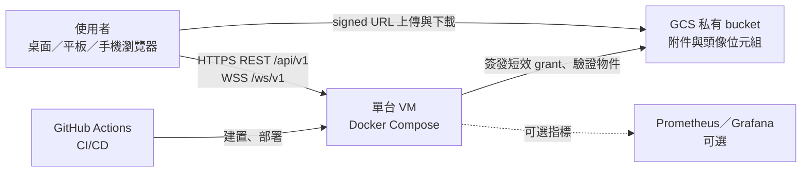
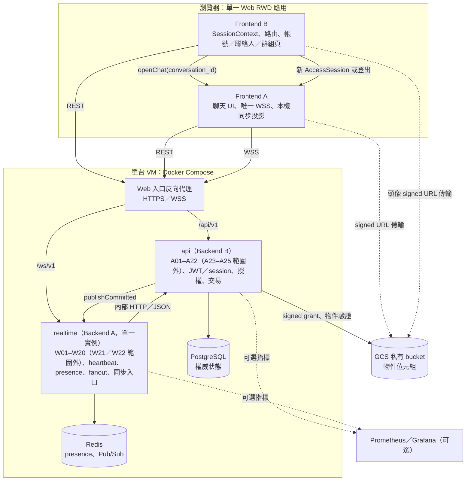
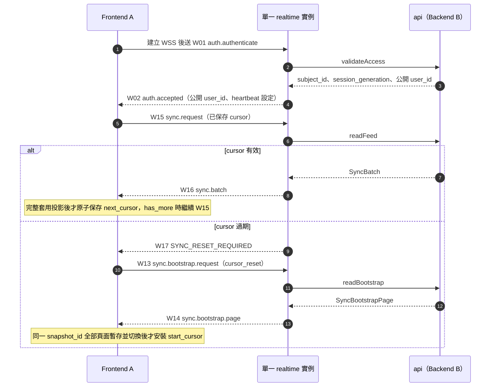
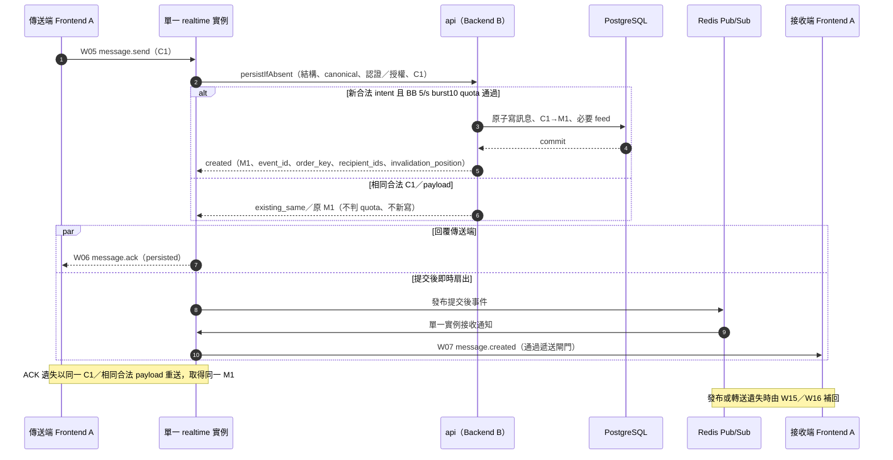
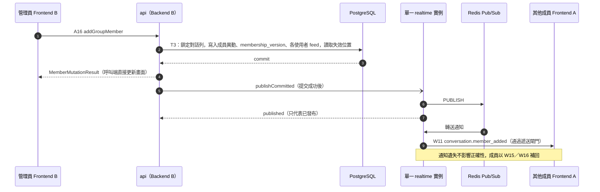
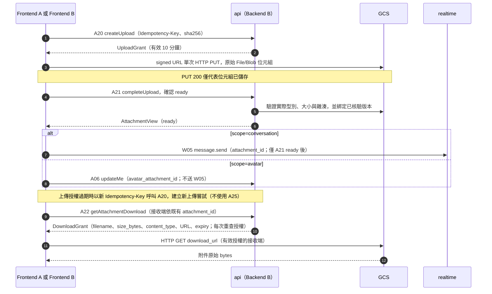
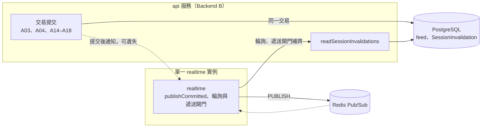
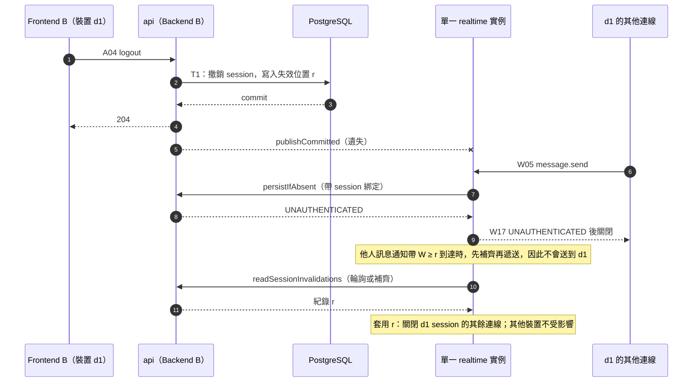
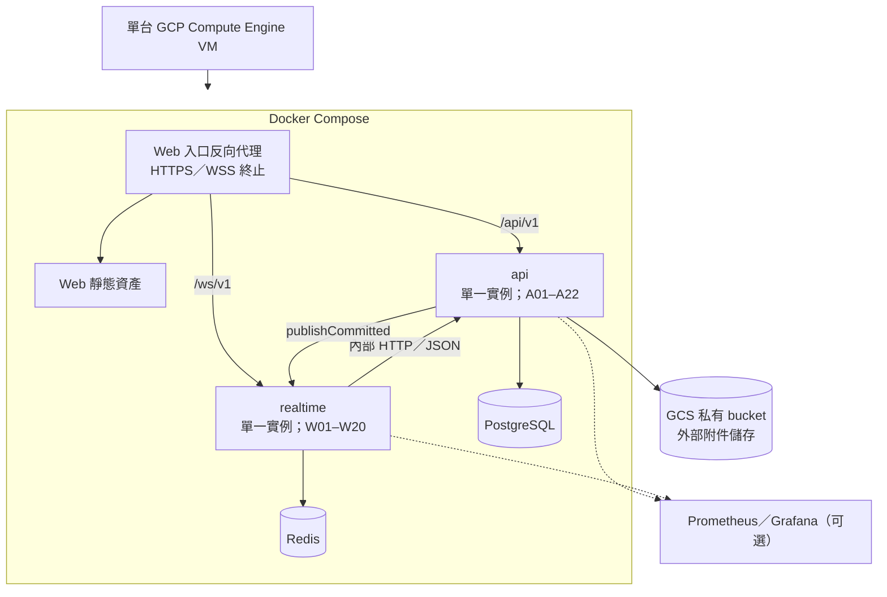

# HINE-IC-0.4 — 系統架構

**狀態：** HINE-IC-0.4 系統架構。本文件描述課程版目標架構，不代表已實作、已部署或已完成測試。介面欄位、事件與錯誤碼以[共同介面契約](../contracts/interface-contract.md)為準；各角色驗收以[角色 PRD](../README.md#按角色閱讀)與[驗收矩陣](../testing/acceptance-matrix.md)為準。

[文件導覽](../README.md) · [共同介面契約](../contracts/interface-contract.md) · [Web/RWD 規格](../ui/web-rwd.md#web-rwd) · [PM 決議事項](../decisions.md)

**來源：** [共同介面契約](../contracts/interface-contract.md)、六份[角色 PRD](../README.md#按角色閱讀)、[Web/RWD 規格](../ui/web-rwd.md#web-rwd)、[專案 README 技術方向](../../README.md#core-technology-direction)、[負載測試規劃](../../tests/load/README.md)，以及 Notion [PM 控制台與團隊協作中心](https://app.notion.com/p/3e9db7b0ff12814c8a79e2a5e383509b)的 PostgreSQL 主資料庫方向。

## 1. 架構原則

1. **先做可展示、可測試、可部署的最小可行產品。** 不預設 Kafka、Cassandra、Kubernetes 或強制微服務。
2. **PostgreSQL 是唯一權威狀態。** 訊息、成員、回條、附件中繼資料與每使用者事件流由後端 B 寫入 PostgreSQL；Redis 僅供通知轉送與使用者線上狀態，不是訊息儲存。
3. **先持久化，再 ACK。** W06 只能在訊息、C1→M1 對應與所有必要事件流列同一交易提交後送出。
4. **即時轉送只為加速，補送保證正確。** Redis Pub/Sub 遺失事件時，由 W15/W16 依每使用者事件流補回；即時 W07 不推進同步游標。
5. **單一可操作分頁與單一 WSS。** 同一瀏覽器設定檔只允許一個可操作聊天分頁；該分頁持有唯一應用程式範圍 WSS。
6. **授權在伺服器端重查。** 用戶端傳入的寄件者或 `subject_id` 一律不採信；後端 B 在每次異動交易內重查授權，後端 A 遞送前重查授權。
7. **本版規格與目標尚未量測。** 數值依 2026-10-01 PM 決議作為本版設定或驗收目標，不代表已驗證容量或 SLO。

## 2. 系統脈絡

- 用戶端是**單一響應式 Web 應用**，服務桌面、平板與手機瀏覽器；不做原生應用程式或 PWA。
- 物件位元組經短效簽署網址直接在瀏覽器與 GCS 私有 bucket 之間傳輸，不經過 WSS，也不是 HINE API 路由。
- Web／原生推播本版範圍外（2026-10-01 PM 決議）；不建立推播 worker 或供應商整合。

## 3. 元件與責任邊界

| 元件 | 負責角色 | 負責 | 不負責 |
|---|---|---|---|
| Web 殼層、工作階段與非聊天頁面 | [前端 B](../prd/frontend-b.md) | SessionContext、AccessSession 保存、A02／A03／A04 流程（不讀取更新憑證 Cookie 值）、DeviceStore、路由與深層連結、帳號／個人資料／聯絡人／群組管理頁、呼叫 `openChat` | 建立 WSS、簽發 JWT、定義線上格式 |
| 聊天模組 | [前端 A](../prd/frontend-a.md) | 唯一 WSS 生命週期、W01–W20 用戶端（W21／W22 本版範圍外）、C1 待送狀態、ACK 合併與去重、SyncCursor 與本機投影、附件訊息、回條 | 更新憑證 Cookie、JWT 簽發、簽署網址、推播派送 |
| `api` 服務 | [後端 B](../prd/backend-b.md) | A01–A22、帳號／工作階段、JWT／Cookie、授權、PostgreSQL 交易／事件流／快照、GCS；W05 的 canonical／C1 與唯一 5/s burst10 產品 quota；發送通知前驗所有 EntityID | 持有用戶端連線、Redis 當訊息儲存、推播工作程序 |
| `realtime` 服務 | [後端 A](../prd/backend-a.md) | W01–W20、WSS 驗證／心跳／在線、Redis Pub/Sub、同步入口、connection/frame defense、W17 mapping；authenticated BB notice 僅結構檢查 | JWT、權威 canonical 長度、W05 產品 quota、最終授權／持久化、活動租約；A23–A25／W21–W22 範圍外不變 |
| 入口、設定、交付與監控 | [維運](../prd/devops.md) | DNS、TLS、路由、機密綁定、GitHub Actions、健康檢查、監控與日誌、可重現的驗證環境 | 產品政策數值的批准 |
| 驗收 | [QA](../prd/qa.md) | 契約、故障注入、隱私、響應式與效能驗收 | 修改共用 API／事件 ID |

`api` 與 `realtime` 之間的[內部交接](../contracts/interface-contract.md#internal-handoffs)是模組契約。兩者同一儲存庫、同一 VM 上以 Docker Compose 部署為兩個獨立程序／容器，各一個實例；可由不同模組選擇不同語言，以 Compose 私有網路的內部 HTTP／JSON 對接並驗證呼叫者服務身分。推播工作程序本版範圍外（2026-10-01 PM 決議）。不按功能另拆微服務。

## 4. 資料權威與狀態分類

| 資料 | 權威位置 | 寫入者 | 遺失或故障時 |
|---|---|---|---|
| 訊息、C1→M1 對應 | PostgreSQL | 後端 B（[persistIfAbsent](../contracts/interface-contract.md#internal-persist-if-absent)） | 未提交即無 W06；結果不明回 `OUTCOME_UNCONFIRMED`，用戶端以同一 C1 重試 |
| 對話、成員、角色、`membership_version` | PostgreSQL | 後端 B（A13–A18） | 版本缺口以 A12 重新取得 |
| 送達／已讀回條 | PostgreSQL | 後端 B（[persistReceipt](../contracts/interface-contract.md#internal-persist-receipt)） | 狀態單調；重複回報為 no-op |
| 每使用者事件流 | PostgreSQL | 後端 B，與觸發它的異動同一交易提交 | 離線補送與斷線復原的唯一依據 |
| 附件中繼資料 | PostgreSQL | 後端 B（A20、A21；A25 本版範圍外） | 未 `ready` 的附件不可使用 |
| 帳號、工作階段、DeviceID 綁定 | 後端 B（儲存結構描述由後端 B 定義） | 後端 B（A01–A04） | 驗證失敗即關閉 |
| 附件與頭像位元組 | GCS 私有 bucket | 瀏覽器經簽署網址 | A21 驗證實際型別、大小與雜湊後才 `ready` |
| 使用者線上狀態、連線登錄 | Redis | 後端 A | 無法確認時回報 `unknown` |
| 裝置活動租約 | 本版範圍外（2026-10-01 PM 決議） | 不適用 | 不建立或消費活動租約 |
| Pub/Sub 即時事件 | Redis（不保存） | 後端 A | 由 W15/W16 補回 |
| SessionContext、AccessSession | 瀏覽器（FB 工作階段狀態；存取權杖不寫入任何持久儲存） | 前端 B（FA 只消費 FB 交付的 AccessSession） | 遺失時依 FB 認證流程重新取得或要求登入 |
| 更新憑證 Cookie | 瀏覽器 Cookie 儲存（HttpOnly/Secure/SameSite） | 後端 B 以 `Set-Cookie` 設定、輪替與判定；瀏覽器保存並在 A03／A04 自動附帶 | 前端程式碼不可讀取或保存其值；FB 只決定何時呼叫 A02／A03／A04（[分工](../contracts/interface-contract.md#refresh-cookie-roles)） |
| DeviceStore | 瀏覽器（安裝範圍） | 前端 B | 遺失或不可重用時採用伺服器回傳的 DeviceID |
| SyncCursor、本機投影、待送 C1 | 瀏覽器 | 前端 A | 游標只在完整套用投影後原子保存 |

## 5. 識別碼、去重與排序

| 識別碼 | 產生者 | 用途 | 限制 |
|---|---|---|---|
| `client_message_id`（C1，UUID） | 傳送端前端 A，每個傳送意圖一次 | 冪等與去重；斷線或 ACK 遺失時沿用 | 同一意圖重試不換 C1；先通過 validation／授權的不同合法內容才 IDEMPOTENCY_CONFLICT，非法 payload 先 INVALID_ARGUMENT |
| `message_id`（M1，UUID） | 後端 B | 標準訊息 ID；即時、歷史與同步中一致 | — |
| 訊息 `event_id`（UUID） | 後端 B，於提交時產生 | 即時 W07 與 W16 重播使用同一值，用戶端據此去重 | — |
| 請求 `event_id`、`correlation_id` | 送出請求的一方 | 回應以 `correlation_id` 對應請求 | 每次嘗試不同，不可取代 C1 |
| `order_key` | 後端 B，於提交時產生 | 對話內訊息排序；A19 由新到舊排序 | 固定 20 位 ASCII 數字字串，搭配 UUID 次排序，依[排序與分頁契約](../contracts/interface-contract.md#ordering-pagination)比較 |
| SyncCursor（`OpaqueCursor`） | 後端 B | 每使用者事件流進度（W15/W16） | 不可解碼；不可與 REST 游標或 歷史 `before` 互換 |
| `snapshot_id`、起始游標 H | 後端 B | W13/W14 一致快照與快照後續傳起點 | 同一快照全部頁面套用前不得安裝 H |
| REST 游標、歷史 `before` | 後端 B | A08、A11、A19 各自分頁 | 錯誤只重啟該查詢，不觸發 W13 |
| `session_generation` | 後端 B | 辨識舊連線與舊活動回報 | — |
| `DeviceID` | 後端 B | 裝置綁定 | 不是憑證 |

## 6. 關鍵流程

### 6.1 連線、驗證與重連補送

- W01 必須是第一個業務訊框；存取權杖放在 W01 承載資料，不放在 URL。
- W03/W04 只代表連線存活，不延長 JWT，也不代表應用程式在前景；W21／W22 活動事件本版範圍外（2026-10-01 PM 決議）。
- [A03](../contracts/interface-contract.md#api-a03) 更新成功後，前端 A 關閉舊 WSS、建立新 WSS，並從已保存游標續傳；不支援同一連線重新驗證。
- 前景期間依 `SYNC_RECONCILE_SECONDS`（10 秒）定期送 W15 對帳。

### 6.2 訊息傳送、持久化 ACK 與即時扇出（單一 realtime 實例）

- W06 與 W07 沒有先後保證；前端 A 依 C1 與 `message_id` 合併成同一則可見訊息。
- 上圖沿用[六階段](../contracts/interface-contract.md#validation-precedence)：BB 的結構／canonical、認證／授權、C1、僅新合法 intent 的產品 quota、持久化。非法／衝突／新 intent 超額分別 W17 INVALID_ARGUMENT／IDEMPOTENCY_CONFLICT／RATE_LIMITED，不進成功提交路徑；BA 保留 transport/frame defense，不先執行 5/s burst10 產品 quota。existing_same 不因目前 quota exhausted 失敗。
- `persisted` 只代表已持久化，不代表送達或已讀。W08/W09 經 [persistReceipt](../contracts/interface-contract.md#internal-persist-receipt) 寫入後，每次都以 W19 回覆請求者（重複請求可能是 `changed:false`）。W10 只在一對一回條狀態實際改變、`status_event_id` 非 null 時產生；群組不發 W10，保留個別 W08／W09／W19 狀態。見[回條交接](../contracts/interface-contract.md#receipt-projection-handoff)。
- 單一 realtime 實例透過 Redis Pub/Sub 發布及接收提交後通知；收件者一律採用後端 B 在提交交易內決定的清單，遞送前依 `invalidation_position` 補齊工作階段失效紀錄；不得以快取成員名單或 `authorize` 結果決定收件者（[BA-05](../prd/backend-a.md#ba-05)、[6.6](#flow-invalidation)）。

### 6.3 REST 群組異動與即時事件

- 事件對應固定為 A14/A16→W11、A15/A17→W20、A18→W12；沒有封鎖操作。
- 後端 B 提交成功後呼叫單一 `realtime` 實例的 [`publishCommitted`](../contracts/interface-contract.md#internal-publish-committed)，該實例經 Redis Pub/Sub 發布提交後通知。REST 結果只取決於提交；通知失敗時由事件流補回，收件者在提交時決定。A03／A04 失效另由失效紀錄保證，見 [6.6](#flow-invalidation)。

### 6.4 附件上傳與下載

- A21 回 ready 後分兩條路徑：`scope=conversation` 才送 W05；頭像使用 `scope=avatar`、`conversation_id:null`，以 A06 指派，不送 W05，也無須任何對話。
- A21 核驗並綁定同一物件版本，A22 只為該已核驗版本簽署下載網址；版本不可用時失敗而不改送最新版本，見[簽署上傳交接](../contracts/interface-contract.md#signed-upload-contract)與[就緒不變條件](../contracts/interface-contract.md#attachment-ready-invariant)。
- 簽署網址與 GCS 物件鍵（object_key）不得寫入訊息、事件或日誌。
- 本版附件僅支援 JPEG、PNG、PDF，單檔最多 10 MiB（10,485,760 bytes），檔名最多 255 個 Unicode 字元；上傳授權有效 10 分鐘、下載授權 5 分鐘。PDF 以下載附件呈現，不內嵌預覽；不做影片、音訊、任意執行檔、SVG／HTML 或分塊續傳。授權過期重新走 A20 建立新嘗試，A25 本版範圍外（2026-10-01 PM 決議）。

### 6.5 背景推播

本版範圍外（2026-10-01 PM 決議）：不納入 Web Push 或 iOS／Android 原生推播，不建立推播 worker、推播意圖處理流程或供應商整合。保留網頁開啟時的 WSS 即時訊息、聊天內提示與查詢後更新的未讀徽章；關閉網頁後不保證通知。

### 6.6 授權失效、連線清理與通知傳遞

本節摘要採單一 `api` 與單一 `realtime` 實例部署。時點術語、順序定義、交付與連線狀態表、型別與操作規則，見[共同介面契約](../contracts/interface-contract.md#internal-notify-invalidation)。

| 保證 | 判定或完成條件 | 依據 | 通知遺失時 |
|---|---|---|---|
| 授權失效：撤銷後的資料（D1） | 授權點在撤銷 R 之後的資料，永不交付給 R 撤銷的對象 | 提交序：工作階段撤銷以 `W ≥ r` 判定，群組撤權以對話列鎖判定 | 不受影響 |
| 授權失效：撤銷前的資料（D2、D3） | 工作階段依開始交付前的未失效／新鮮／權杖檢查；群組待送內容依已批准 E1 | [D2 與 E1](../contracts/interface-contract.md#group-revocation-e1) | 工作階段與群組均於撤銷提交後最遲 15 秒停止開始交付；不是資料抵達期限 |
| 授權失效：新操作（D4） | R 之後的舊身分操作被拒 | 交易內工作階段檢查 | 不受影響 |
| 連線清理 | `realtime` 實例將連線標記失效並關閉；沒有全域完成回報 | 通知、每 `INVALIDATION_POLL_SECONDS` 輪詢、遞送閘門補齊、存取權杖到期 | 後端 B 可連線時，最遲在下一次輪詢的完整補齊並套用後完成（輪詢間隔加一次補齊）。不可連線時依[狀態表](../contracts/interface-contract.md#delivery-state-table)：仍新鮮時連線保留、撤銷前資料可交付、需補齊的事件逾時放棄（第 6 列）；不新鮮後只送 W04／W17、不交付資料（第 7 列）；兩者最遲都在存取權杖到期時關閉 |
| 通知傳遞 | 盡力傳遞 | `publishCommitted` → Redis Pub/Sub | 群組事件由事件流補回；工作階段失效由失效紀錄補回 |

- 「多久內關閉連線」只是清理時間，不能代替資料交付政策。群組撤權分為裝置已有副本、服務端已授權待送內容與撤權後新查詢，分別依 G1、G2／E1、G3 處理。
- 順序以 PostgreSQL 提交序判定。資料的位置是它的授權點，不是它的提交；與撤銷並行、授權點在撤銷之前的交易依 E1 上限處理。
- W18 線上狀態沒有後端 B 的授權點，視為節點最近一次完整補齊時授權，適用相同新鮮度上限。
- 保留連線不等於允許送資料：節點不新鮮時，連線保留，但只送 W04 與 W17。
- A03 只使舊世代連線失效；A04 只撤銷目前裝置的工作階段；A02 重新登入會撤銷同帳號同裝置原有的工作階段；A18 只影響該對話，不關閉連線。
- 同一瀏覽器設定檔只允許一個可操作分頁與一條 WSS；不做多分頁交接或活動租期。
- [正式通知驗證](../contracts/interface-contract.md#committed-notice-validation)：BB 生成／送出前 canonical 驗所有 EntityID，不合法不得通知；BA 先驗 caller 是 authenticated BB，再驗結構／required／null／type／enum／UUID／source，不重算 EntityID 的 Unicode 長度。既有提交後發布、失效／遞送閘門與範圍決策不變。
- 使用者事件流涵蓋 W07、W10（一對一回條）、W11、W12、W20，不含工作階段失效；工作階段失效另存於 SessionInvalidation 紀錄，不回傳給用戶端。

A04 撤銷且通知遺失：

圖中後端 B 回的 `UNAUTHENTICATED` 指使用者工作階段層（[C13](../contracts/interface-contract.md#internal-auth-layer)：可信回應且 `details.auth_layer:"user_session"`），節點只關閉這次呼叫所屬的連線；服務身分層、缺少分層或非可信回應按依賴失敗回 W17 `DEPENDENCY_UNAVAILABLE`：已驗證連線不因此關線（仍依狀態表與生命週期），新 W01 則不回 W02 並關閉未驗證連線，不宣稱工作階段已撤銷。

## 7. 部署拓樸

| 路徑 | 目的地 | 公開 | 說明 |
|---|---|---|---|
| `https://hine.run.place/api/v1/...` | `api` | 是 | [A01–A22](../contracts/interface-contract.md#rest-api)；A23–A25 僅保留 ID，本版不提供路由 |
| `wss://hine.run.place/ws/v1` | `realtime` | 是 | [W01–W20](../contracts/interface-contract.md#websocket-events)；W21／W22 僅保留 ID，本版不處理 |
| `/`、`/login`、`/register`、`/contacts`、`/chats`、`/chats/{conversation_id}`、`/profile`、`/groups/{conversation_id}/manage` | Web 殼層 | 是 | [DO-06](../prd/devops.md#do-06)；`/` 只負責導向，見[根路徑規則](../ui/web-rwd.md#rwd-root-route)；不得把 `/api/v1`、`/ws/v1` 改寫到 Web 殼層 |
| `/health/live`、`/health/ready` | 各服務 | 否 | 內部健康檢查，回應格式見 [HealthResponse](../contracts/interface-contract.md#data-dictionary) |
| `/internal/v1/*` | `api`、`realtime` | 否 | 內部操作；公開入口不得轉送，使用[內部呼叫憑證](../contracts/interface-contract.md#internal-caller-credential) |
| GCS 簽署網址 | GCS | 短效 | 不是 HINE API 路由 |

**架構約束：**

- `api` 與 `realtime` 各部署一個實例於同一 VM 的 Compose 私有網路；不採 Cloud Run、執行個體群組、自動擴縮或高可用架構。
- 入口必須支援 WebSocket 升級，閒置逾時必須大於 `HEARTBEAT_INTERVAL_SECONDS`。
- VM、Compose 服務重新啟動或重新部署時，既有 WSS 連線會中斷；用戶端依 [6.1](#flow-connect) 重連，並從已保存游標續傳。
- PostgreSQL 使用持久化磁碟；維運須保留資料庫備份並演練還原，部署須保留可回滾版本。
- `DATABASE_URL`、`REDIS_URL`、JWT 與內部呼叫憑證由 VM 上權限受控的 Compose secrets／環境檔注入；機密不得提交 Git。完整設定表見[部署設定](../contracts/interface-contract.md#deployment-config)。
- GCS 私有 bucket 在 VM 外部；資料庫、Redis、內部 API 不公開，只有 Web HTTPS／WSS 入口對外。
- Prometheus／Grafana 為可選監控，不是部署前提；本版不承諾高可用。

## 8. 失效模式與降級

| 情境 | 系統行為 | 正確性依據 |
|---|---|---|
| `realtime` 重啟或連線中斷 | 用戶端重新連線至單一實例，W01/W02 後以已保存游標送 W15 | PostgreSQL 事件流 |
| Redis 無法使用 | 線上狀態為 `unknown`；`realtime` 的 `/health/ready` 回 503；即時通知中斷 | 已提交訊息由 W15/W16 補回 |
| PostgreSQL 無法使用或交易回滾 | 不送 W06；回 `PERSISTENCE_FAILED` 或 `DEPENDENCY_UNAVAILABLE`；`api` 的 `/health/ready` 回 503 | 未提交即不宣告成功 |
| 已提交但 ACK 遺失 | 用戶端以同一 C1 重送 | 回傳同一 M1（`existing_same`） |
| 寫入結果不明 | 回 `OUTCOME_UNCONFIRMED` | 以同一 C1 重試確認 |
| Pub/Sub 發布遺失 | 不影響 W06 | W15/W16 補回 |
| 事件流游標過期 | W17 `SYNC_RESET_REQUIRED`，改走 W13/W14 | 一致快照 |
| REST 游標過期或無效 | 只重啟該 REST 查詢 | 不影響事件流游標 |
| GCS 無法使用 | A22 回 `DEPENDENCY_UNAVAILABLE`；文字訊息不受影響 | 附件中繼資料仍在 PostgreSQL |
| 推播供應商 | 本版範圍外（2026-10-01 PM 決議）；不建置推播流程 | 不適用 |
| 存取權杖過期或 A03 更新 | 關閉舊 WSS，建立新 WSS | 從已保存游標續傳 |
| 慢速消費者 | 限制每條連線的輸出量（[BA-08](../prd/backend-a.md#ba-08)） | 未送達內容由事件流補回 |
| 後端 B 提交後通知失敗（`publishCommitted` 或 Pub/Sub 遺失） | REST 照常回成功；群組事件不即時送達 | 事件流（W15/W16）；收件者在提交時決定 |
| 工作階段失效通知遺失 | 失效連線的新操作在後端 B 被拒；撤銷後資料被遞送閘門擋下；撤銷前資料最晚於提交後 15 秒停止開始交付（非抵達期限）；後端 B 可連線時完成補齊後關線；不可連線時依狀態表 | SessionInvalidation 紀錄；[狀態表](../contracts/interface-contract.md#delivery-state-table) |
| `realtime` 無法連到後端 B | 仍新鮮時連線保留、後端 B 操作失敗、新 W01 被拒、撤銷前資料可交付至新鮮期滿、逾時事件放棄即時遞送；不新鮮時只送 W04／W17、不交付資料；恢復後先完整補齊；最遲權杖到期關閉 | 不假定仍有權；[狀態表](../contracts/interface-contract.md#delivery-state-table) |
| 節點的失效位置早於保留範圍 | 關閉單一實例所有連線，從最新位置重新開始 | 用戶端重連時重新驗證 |

## 9. 安全架構

- 所有公開流量使用 HTTPS/WSS；健康檢查不公開。
- REST 使用 Bearer 存取 JWT；WSS 在 W01 承載資料傳存取權杖。更新憑證只存在 HttpOnly/Secure/SameSite Cookie，不出現在 JSON：由後端 B 設定、瀏覽器保存與附帶，前端程式碼不可讀取；FB 管理 AccessSession 與認證流程，FA 只消費 AccessSession。
- 後端 A 經 [validateAccess](../contracts/interface-contract.md#internal-validate-access) 驗證簽章、簽發者／受眾、裝置綁定與撤銷狀態；只有後端 B 持有 JWT 簽章金鑰。
- 內部 `subject_id` 不進入任何用戶端欄位；公開身分只使用 `user_id`。
- 後端 B 在異動交易內重查授權與工作階段；後端 A 只遞送給後端 B 在提交時決定的收件者，並在遞送前補齊工作階段失效紀錄。被移除的成員只收到自己的最小 W12 通知，不再收到後續內文。
- 內部操作走 Compose 私有網路 `/internal/v1/*`，以[內部呼叫憑證](../contracts/interface-contract.md#internal-caller-credential)驗證呼叫者；公開入口不轉送。
- 簽署網址為短效，只發給有權限者；A21 驗證實際位元組；A22 每次重查授權。A25 本版範圍外；上傳授權過期重新走 A20。
- 日誌與指標不得包含完整權杖、密碼、訊息內文、簽署網址或高基數的使用者 ID 標籤。
- 速率限制、上傳大小與 MIME 允許清單採用 2026-10-01 PM 決議的本版設定；未量測。

## 10. 可觀測性

- `/health/live` 只回報程序存活（200，依賴可為 `not_checked`）；`/health/ready` 回報必要依賴是否就緒（200 或 503）。`HealthResponse.service` 區分 `api` 與 `realtime`。
- 監控訊號：ACK 延遲、即時遞送、同步復原與依賴就緒狀態。若啟用 Prometheus／Grafana，指標以 Prometheus 蒐集、Grafana 呈現。
- 缺少設定時以 `CONFIG_MISSING` 等公開安全原因診斷，不揭露設定名稱或值。

## 11. 交付流程與環境

- 目前 [`repository-checks.yml`](../../.github/workflows/repository-checks.yml) 只檢查專案結構與常見機密檔名。
- 目標流程（[DO-03](../prd/devops.md#do-03)）：PR 檢查 → 受控測試環境部署 → 健康檢查／REST／WSS 冒煙測試 → 經授權的正式環境升版，並保留可回滾版本。
- `HINE_ENV` 區分環境；本版部署目標為單台 GCP VM 上的 Docker Compose，實際雲端資源尚未建立。

## 12. 容量與效能驗證

- 本版課程基線：50 個測試使用者／50 條 WSS、25 個一對一聊天室，每使用者平均每 5 秒發 1 則不超過 1 KiB 的文字訊息，持續 10 分鐘；另做一個 50 人群組功能驗收，流量不混入基線。
- 量測須記錄 VM、資料集、網路、測試工具與版本，並報告成功率、p95、CPU／RAM。初始目標為正常基線訊息送出至收件端呈現 p95 ≤ 2 秒；有效登入、網路恢復且待補不超過 100 則時，重連完成同步目標 ≤ 5 秒。已提交訊息須能經同步找回並去重；不得以空連線數代替聊天負載，也不得把 ACK 當成收件端顯示。數值未實測，未達標須揭露原因與結果，不宣稱高可用；正式評分表若有硬性門檻仍須保留。
- 1,000／5,000／10,000 條連線僅作未來壓測，非本版必交容量。QA 自選一套熟悉的 HTTP＋WebSocket 測試工具或語言；協定負載報告與真實瀏覽器端到端驗收分開標示。

## 13. 程式碼目錄對應

| 目錄 | 負責角色 | 對應架構元件 |
|---|---|---|
| `frontend/app/auth/`、`frontend/app/contacts/`、`frontend/app/profile/` | 前端 B | Web 殼層、工作階段與非聊天頁面 |
| `frontend/app/chat/` | 前端 A | 聊天模組與唯一 WSS |
| `backend/api/` | 後端 B | `api` 服務 |
| `backend/realtime/` | 後端 A | `realtime` 服務 |
| `backend/common/`（若採用） | 各模組負責人決定 | 可選共用實作；跨語言共同依據是介面文件、Schema 與測試樣例，不要求共用原始碼或 ORM |
| `infra/docker/`、`infra/gcp/`、`infra/monitoring/`、`infra/scripts/` | 維運 | Compose、VM 部署、可選監控與維運腳本 |
| `.github/workflows/` | 維運 | CI/CD |
| `tests/integration/`、`tests/e2e/`、`tests/load/` | QA | 整合、端對端與負載測試 |

各模組負責人自選熟悉的程式語言與框架；共同約束為既定 HTTP／JSON、WebSocket 事件格式、驗證方式、資料格式及可重現的啟動／測試方式。跨語言共用介面文件、Schema 與測試樣例，不要求共用 `backend/common/` 原始碼或 ORM。FA／FB 須整合成單一 Web 體驗，不新增微前端平台（2026-10-01 PM 決議）。

## 14. 架構決策

| 決策 | 最終決定（2026-10-01 PM 決議） |
|---|---|
| [GCP 執行環境與託管服務](../decisions.md#decision-runtime-platform) | 單台 GCP Compute Engine VM＋Docker Compose；Web 入口、`api`、`realtime`、PostgreSQL、Redis 同機各一實例；附件使用外部 GCS 私有 bucket；不採 Cloud Run、Cloud SQL、Memorystore、外部 Load Balancer、執行個體群組、Kubernetes 或自動擴縮。 |
| [前後端框架與程式語言](../decisions.md#decision-tech-stack) | 各模組自選熟悉語言／框架；以 HTTP／JSON、WebSocket 事件、驗證、資料格式與可重現啟動／測試為共同約束；不要求共用 `backend/common/` 原始碼或 ORM。 |
| [`api`／`realtime` 部署單元與內部呼叫方式](../decisions.md#decision-service-topology) | 同一主機上兩個獨立程序／容器，各一實例；Compose 私有網路內部 HTTP／JSON，驗證服務身分；推播工作程序本版範圍外。 |
| [REST 寫入後的即時通知與授權失效](../decisions.md#decision-realtime-notify) | PostgreSQL 交易提交後呼叫 `publishCommitted`，以單一 Redis Pub/Sub 通知；正確性由 PostgreSQL 事件流與失效紀錄保證。 |
| [負載測試工具](../decisions.md#decision-load-tool) | QA 自選一套熟悉的 HTTP＋WebSocket 工具或語言，記錄選擇與啟動命令；負載依課程基線。 |
| [營運上限與速率](../decisions.md#decision-operational-values) | 採用 PM 決議本版數值表；活動租約與推播設定範圍外。 |
| [活動租約與未知狀態推播受眾](../decisions.md#decision-activity-push) | 活動租約、W21／W22 與 unknown 推播對象判斷本版範圍外。 |
| [Web Push 範圍與供應商](../decisions.md#decision-web-push) | Web／iOS／Android 推播本版範圍外；不建立推播 worker 或供應商整合。 |
| [歷史效能與重連目標](../decisions.md#decision-historical-slos) | 採課程基線；1,000／5,000／10,000 連線僅未來壓測。 |

## 15. 不在本架構範圍

- Kafka、Cassandra、Kubernetes 或強制微服務拆分。
- 以 Redis 作為訊息儲存或 ACK 依據。
- 原生應用程式、PWA／完整離線產品。這些非目標不排除既有本機持久保存義務：W05 前保存 C1／承載資料、W08 前持久保存已收訊息及其識別資訊（不需先取得伺服器回條）、投影與 SyncCursor 原子保存，完整 W14 後才安裝 H；見[本地保存邊界](../contracts/interface-contract.md#local-persistence-boundary)。
- Web／原生推播、活動租約與多分頁同步（本版範圍外，2026-10-01 PM 決議）。
- 群組已讀人數／名單彙總與 A25 上傳授權續期（本版範圍外）；附件授權過期重新走 A20。
- 同一連線重新驗證，或因響應式版面建立第二條 WSS。
- 群組封鎖操作。
